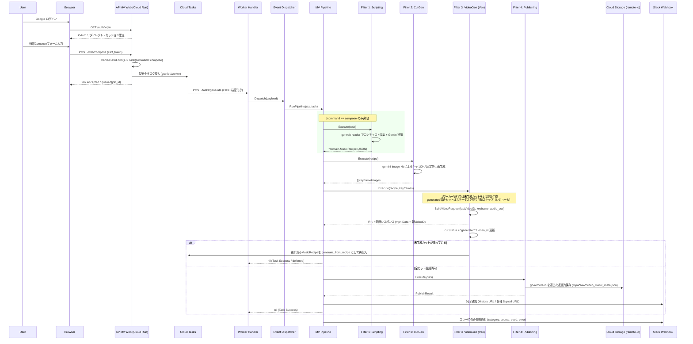

# 🎬 AP MV (AP Music Video Orchestrator)

## 🚀 概要 (Overview) - 楽曲同期型・連鎖動画オーケストレーター

**AP MV (AP Music Video Orchestrator)** は、**Music Recipe（音楽レシピ / 楽曲構成書）** から時間軸のタイムラインを自動補完・構造化し、Google の次世代動画生成 AI **Veo (Vertex AI / Gemini API)** および音楽生成 AI **Lyria 3** を統合制御することで、**キャラクターの一貫性（DNA）を完全に維持した楽曲同期型動画作品**を自動生成する、サーバーレス・非同期オーケストレーターです。

堅牢なインフラ防壁群（`netarmor`, `go-http-kit`, `go-remote-io`, `gcp-kit`, `go-prompt-kit`）をフルレイヤーで組み込み、Web UI からの非同期受付、Cloud Tasks を用いた流量制御、API制限（429）を回避するセマフォ制御、そして **Video-to-Video（動画ID連鎖）** による文脈維持をワンストップで指揮（Compile）します。

「時間軸のタイムライン制御（Timeline Logic）」へと進化させ、映像指示、BGMの拍子・感情・盛り上がり（Audio Cue）がミリ秒単位で完全にシンクロした商業クオリティの映像パイプラインを提供します。

---

## ✨ コア・アーキテクチャ・原則 (Design Principles)

本システムは、従来のヘキサゴナルアーキテクチャが陥りがちだった「アダプター層の肥大化と階層移動のオーバーヘッド」を解消するため、データの流れる美しさに特化した **「パイプ＆フィルター (Pipe and Filter)」** と、堅牢な非同期バッチを支える **「イベント駆動型 (Event-Driven)」** のハイブリッド構成を採用しています。

### 🧬 クアッド・ファクター・コンシステンシー制御 (Consistency Control)

動画AI（Veo）における最大の課題である「カットごとの容姿・文脈の破綻」を防ぐため、以下の4大要素を同期させて1つのリクエストを決定論的に構築します。

* **Seed-Based Determinism**: キャラクター固有 Seed 値の完全管理による再現性の担保。
* **Keyframe Anchor**: `gemini-image-kit` を応用。キャラクター Seed と参照画像から、ブレのない静止画キーフレームを高精度生成してベースに指定。
* **Audio-Driven Prompting**: Music Recipe の `audio_cue`（例: `synchronized with the heavy bass drop at 0:10`）を Veo 用プロンプトへ自動インジェクション。
* **Context Chain (Video-to-Video)**: 前のループで生成された `VideoID` を次カットの `PreviousVideoID` として数珠繋ぎに連鎖させ、カット間の文脈を極限まで維持。

### 🔁 Resumable Video Chain (レジューム機能)

動画生成パイプラインは極めて重い処理であるため、各 `cut` は `status`、`video_id`、`video_url` をメタデータとして保持します。生成途中でタイムアウトやAPIエラーにより失敗した場合でも、再試行時は `status=generated` のカットを自動的にスキップ。保持済みの `video_id` を次カットの `PreviousVideoID` に引き継ぎ、**「途中のカットから安全に再開」** することができる回復性（Resilience）を備えています。

### ⛓ Cut-by-Cut Task Chaining (Cloud Tasks タイムアウト対策)

Veo の1カット生成は長時間の Long-Running Operation になるため、複数カットを1つのHTTPワーカー内で直列生成し続けると、Cloud Tasks / Cloud Run のタイムアウトに衝突します。現在の `VideoGenerationFilter` は **1回のワーカー実行で未生成カットを1つだけ生成** し、まだ未生成カットが残っている場合は、更新済みの `MusicRecipe` を `generate_from_recipe` タスクとして再度 Cloud Tasks に投入します。

これにより、各ワーカー実行の責務は「1カット生成 + 状態更新 + 次タスク委譲」に分割されます。`status=generated` のカットは後続タスクでスキップされ、最後のカットが完了した実行だけが `Publishing` へ進みます。

### ⏳ Audio-Driven Timeline Logic (柔軟なタイムライン展開)

原稿から抽出された `MusicRecipe` JSON が `sections` ベース（長尺セクション単位）で届いた場合でも、システム内の正規化機構（`Normalize()`）によって、各セクションの `duration_seconds` から独立した `cuts` 列（秒数、開始・終了時間）を自動計算・展開。テンポ（`tempo_bpm`）や雰囲気（`style`）に完全に同期したタイムラインを動的に組み立てます。

### 🛡 エンタープライズ・コンカレンシー & 防壁 (Security Layer)

* **Token-Bucket & Semaphore**: `golang.org/x/time/rate` による流量制御とセマフォによる同時実行数制御を行い、Veo/Lyria API のレートリミット（429）を全自動で回避。
* **Network Armor**: `go-http-kit` と連動し、外部API通信およびGCSリクエストの接続直前で SSRF、DNS Rebinding、TOCTOU攻撃をIPレベルで遮断。
* **Singleflight Protection**: 大容量の動画・音声アセットの重複フェッチや二重アップロードをインメモリで完全に抑制。
* **Session-backed CSRF**: WebフォームのCSRFトークンは `gorilla/sessions` のCookieセッションに保存し、POST時に定数時間比較で検証します。Cookie署名キーには起動時ランダム値ではなく `SESSION_SECRET` を使うため、Cloud Run の再起動や複数インスタンス間でも検証が安定します。

---

## 🎨 ワークフローと4つの生成フィルター (Workflows)

`internal/worker/filter/` 配下の各フィルターは単一責任を持ち、データ構造をパイプラインで流しながら段階的に濃縮していきます。

| フィルター工程 | 担当モジュール | 役割・内容 |
| --- | --- | --- |
| **1. Scripting** | `1_scripting.go` | 原稿（URL/Text/Image）から `go-web-reader` でコンテキスト収集。歌詞・構成・拍子・Audio Cueを含む **Music & Video Recipe JSON** を生成（`go-gemini-client` 駆動）。 |
| **2. Cut Keyframe Gen** | `2_cut_gen.go` | `gemini-image-kit` を内包。キャラクター固有 Seed とビジュアル特徴、参照URLから、ブレのない高精度なキーフレーム静止画をインメモリ圧縮しながら一括生成。 |
| **3. Video Gen (Veo)** | `3_video_gen.go` | **【核心部】** キーフレーム（`ImageReference` 優先）、`AudioReference`、プロンプト、`PreviousVideoID`、Seed をまとめ、Veo API 実装へ投入。未生成カットを1つ生成し、残りがあれば更新済みレシピを次の Cloud Tasks へ委譲。Video-to-Video 連鎖とレジューム（スキップ）を制御。 |
| **4. Publishing** | `4_publishing.go` | 生成された複数のカット動画（mp4）と音声セグメント（WAV/MP3）をロスレス統合またはエンコード。完成動画と更新された `video_music_meta.json` を GCS へ永続化。 |

---

## 🔌 Veo Adapter Boundary

Veo API への実通信は **`ports.VideoRunner`** インターフェースに分離しています。`ports.VideoRunner` / `VideoGenerationRequest` / `VideoResponse` は `github.com/shouni/go-veo-orchestrator v1.0.4` の型を alias しており、オーケストレーター側の契約と同じ形で扱います。

production では `internal/adapters.VertexVeoRunner` を DI します。local / non-production では `MockVeoRunner` を使い、実 API を呼ばずにパイプラインを検証できます。

### `VertexVeoRunner` の責務

* Application Default Credentials で `https://www.googleapis.com/auth/cloud-platform` の OAuth token を取得
* Vertex AI Veo の `:predictLongRunning` にリクエストを送信
* `:fetchPredictOperation` をポーリングし、完了した `gcsUri` を取得
* OAuth2 HTTP クライアントには30秒の単一リクエストタイムアウトを設定
* ポーリング中の一時的な通信エラーは連続10回まで許容
* `ImageReference` がある場合は `image.gcsUri` として投入
* 前カットの `VideoID` が `gs://...mp4` の場合は `video.gcsUri` として投入し、Video-to-Video 連鎖を維持
* 生成結果の `gcsUri` を `VideoResponse.CloudURL` と `VideoResponse.VideoID` に返し、次カットへ引き継ぐ

### Veo Environment Variables

| 変数 | デフォルト | 用途 |
| --- | --- | --- |
| `VEO_MODEL` | `veo-3.1-generate-001` | Vertex AI Publisher Model ID |
| `VEO_OUTPUT_PREFIX` | `ap-mv/veo` | Veo 生成物の GCS 出力 prefix |
| `VEO_ASPECT_RATIO` | `16:9` | `16:9` または `9:16` |
| `VEO_GENERATE_AUDIO` | `false` | Veo 3 系の `generateAudio` 指定。別途音楽トラックを合成する場合は `false` を推奨 |
| `VEO_POLL_INTERVAL` | `10s` | long-running operation のポーリング間隔 |
| `VEO_OPERATION_TIMEOUT` | `20m` | 1カット生成の最大待機時間 |

production 実行には、既存の `GCP_PROJECT_ID`、`GCP_LOCATION_ID`、`GCS_MUSIC_BUCKET` も必須です。`GCS_MUSIC_BUCKET` は `my-bucket` または `gs://my-bucket` のどちらでも受け付け、設定ロード時に `gs://` プレフィックスを取り除いて正規化します。実行サービスアカウントには Vertex AI の実行権限と、`GCS_MUSIC_BUCKET` への書き込み権限が必要です。

### Web Security Environment Variables

| 変数 | 用途 |
| --- | --- |
| `SESSION_SECRET` | OAuth セッションおよびCSRF CookieセッションのHMAC署名キー。productionでは必須。Cloud Run の全インスタンスで同じ値を設定してください。 |
| `SESSION_ENCRYPT_KEY` | OAuth セッション暗号化キー。productionでは必須。16 / 24 / 32 bytes のいずれか。 |
| `GOOGLE_CLIENT_ID` | Google OAuth クライアントID |
| `GOOGLE_CLIENT_SECRET` | Google OAuth クライアントシークレット |

local / non-production で `SESSION_SECRET` が未設定の場合、WebフォームCSRF用には開発用固定キーを使います。本番では `ValidateEssentialConfig()` が `SESSION_SECRET` 未設定をエラーにします。

---

## 📂 プロジェクト構造 (Project Structure)

データフローの時系列に沿って綺麗にパッキングされ、無駄な階層移動を極限まで削ぎ落とした洗練されたフォルダレイアウトです。

```text
ap-mv/
├── main.go                 # エントリーポイント
├── Dockerfile              # Cloud Run 向け FROM scratch コンテナ定義
├── assets/                 # embed.FS で配布する静的・プロンプト資産
│   ├── prompts/            # 作詞・作曲・カバーアート・Veo動画用プロンプトテンプレート
│   └── templates/          # Web UI テンプレート（Zunda Greenを基調としたショーケースUI）
└── internal/
    ├── config/             # envutil を用いた環境変数ロードと設定検証（Lyria/Veo/GCS等）
    ├── domain/             # 外部依存のない純粋なドメインモデル（music_recipe, cut, job_id検証）
    ├── web/
    │   ├── controllers/    # フロントエンド制御（Google OAuth認証、セッション、共通フォーム処理）
    │   └── router.go       # chiを用いたWebルーティング、SESSION_SECRETベースのCSRFミドルウェア適用
    └── worker/
        ├── event/          # Cloud Tasks ペイロードのデコードおよびディスパッチャー
        ├── pipeline/       # command 別の生成フロー（mv_pipeline.go）と共通エラーハンドリング
        └── filter/         # 【パイプ＆フィルターの実体】単一責任の各処理フィルター
            ├── filter.go   # 各フィルターが満たすべき共通インターフェースの定義
            ├── 1_scripting.go    # 原稿から Music & Video Recipe JSON を生成
            ├── 2_cut_gen.go      # 各カットの静止画キーフレームを高精度生成
            ├── 3_video_gen.go    # Veo APIへの数珠繋ぎ（Video-to-VideoID連鎖）動画生成（★核心部）
            └── 4_publishing.go   # mp4/WAVのロスレス統合、およびメタデータJSONのGCS保存

```

---

## 🔄 シーケンスフロー (Sequence Flow)



---

## 🚀 使い方 (Usage)

### 1. Web経由の通常生成フロー（Compose）

1. Google OAuthで安全にログインします。
2. トップ画面より、`url`、`text`、`image`を入力し送信します（Cloud Tasks 経由で即座に202 Accepted）。
3. 非同期ワーカーが起動し、`Filter 1`〜`Filter 4` がストリーム駆動します。動画生成は1カットずつ Cloud Tasks に再投入され、最後のカット完了後に成果物のメタデータがGCSの `video_music_meta.json` にパブリッシュされ、Slackに通知が飛びます。

### 2. 確定済み MusicRecipe JSON からのダイレクト動画再生成 / レジューム

1. `/web/generate-from-recipe` 画面を開きます。
2. 構造化済みの `MusicRecipe` JSON データをフォームに直接貼り付けて送信します。
3. WebハンドラーがJSONをデコード・検証し、`Filter 1 (Scripting)` を完全にスキップして **`Filter 2 (CutGen)`**、あるいは失敗データの **`Filter 3 (VideoGen)`** からダイレクトに実行を再開（レジューム）します。クォータ制限で落ちたジョブのリカバリや、同一構成での再ビルドが驚くほど高速に行えます。

### 3. 安全なメディアストリーミングと削除

1. `/web/history` 画面から過去の生成動画・音声を一覧表示。履歴は `errgroup` によるメタデータの並行フェッチと10分TTLキャッシュにより高速駆動します。
2. ユーザーが再生をリクエストすると、`domain.ValidateJobID` によりパストラバーサル等の攻撃を完全遮断した上で、GCSの一時的な署名付きURL（1時間有効）へ302リダイレクトしてブラウザに安全にストリーミングします。
3. 不要になったアセットは、`DELETE /web/history/{jobID}` を `X-CSRF-Token` 検証付きで呼び出すことで、GCS上の動画、音声、メタデータJSONをすべて一連削除します。

---

## 📜 ライセンス (License)

* このプロジェクトは [MIT License](https://opensource.org/licenses/MIT) の下で、ポートフォリオ契約およびクローズド開発向け統合資産としてライセンスされています。
