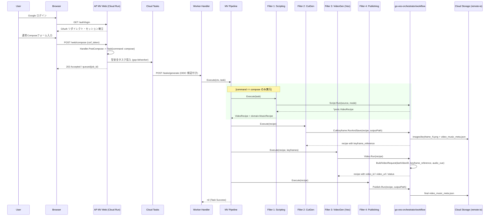

# 🎬 AP MV (AP Music Video Orchestrator)

## 🚀 概要 (Overview) - 楽曲同期型・連鎖動画オーケストレーター

**AP MV (AP Music Video Orchestrator)** は、**Music Recipe（音楽レシピ / 楽曲構成書）** から時間軸のタイムラインを自動補完・構造化し、Google の動画生成 AI **Veo (Vertex AI)** と Gemini 系モデルによる台本生成・キーフレーム生成をつなぐ、Cloud Run / Cloud Tasks 前提の非同期オーケストレーターです。

Web UI からの非同期受付、Cloud Tasks による worker 起動、`go-veo-orchestrator/workflow` による Script / Keyframe / Video / Publish の実処理、そして **Video-to-Video（動画ID連鎖）** による文脈維持をひとつのアプリケーションとして構成します。`pkg/go-veo-orchestrator` は将来別リポジトリに分離する前提で、現時点では nested module + root `replace` で参照しています。

「時間軸のタイムライン制御（Timeline Logic）」へと進化させ、映像指示、BGMの拍子・感情・盛り上がり（Audio Cue）がミリ秒単位で完全にシンクロした商業クオリティの映像パイプラインを提供します。

---

## ✨ コア・アーキテクチャ・原則 (Design Principles)

本システムは、外部サービス境界には ports/adapters による疎結合を維持しつつ、生成処理の本体はデータ変換の流れが追いやすい **「パイプ＆フィルター (Pipe and Filter)」** として構成しています。

また、Web UI からの受付と重い生成処理を分離するため、Cloud Tasks を用いた **非同期タスク駆動 (Task/Event-Driven) Worker Execution** を採用し、タイムアウトしやすい動画生成バッチを安全に継続・再実行できる構成にしています。

### 🧬 クアッド・ファクター・コンシステンシー制御 (Consistency Control)

動画AI（Veo）における最大の課題である「カットごとの容姿・文脈の破綻」を防ぐため、以下の4大要素を同期させて1つのリクエストを決定論的に構築します。

* **Seed-Based Determinism**: キャラクター固有 Seed 値の完全管理による再現性の担保。
* **Keyframe Anchor**: `gemini-image-kit` を応用。キャラクター Seed と参照画像から、ブレのない静止画キーフレームを高精度生成してベースに指定。
* **Audio-Driven Prompting**: Music Recipe の `audio_cue`（例: `synchronized with the heavy bass drop at 0:10`）を Veo 用プロンプトへ自動インジェクション。
* **Context Chain (Video-to-Video)**: 前のループで生成された `VideoID` を次カットの `PreviousVideoID` として数珠繋ぎに連鎖させ、カット間の文脈を極限まで維持。

### 🔁 Resumable Video Chain (レジューム機能)

動画生成パイプラインは極めて重い処理であるため、各 `cut` は `status`、`video_id`、`video_url` をメタデータとして保持します。生成済み状態を含む `video_music_meta.json` または Recipe を再投入した場合、`status=generated` のカットをスキップし、保持済みの `video_id` を次カットの `PreviousVideoID` に引き継げます。これにより、生成済みメタデータを起点に途中カットから再開しやすい回復性（Resilience）を備えています。

### ⛓ Cloud Tasks Worker Execution

Web UI はリクエストを Cloud Tasks に投入し、worker ルート `/tasks/generate` が OIDC 検証後に pipeline を実行します。現在の実処理は `go-veo-orchestrator/workflow` に集約しており、Script / Cut Keyframe / Video / Publish の各 runner を worker 実行内で順に呼び出します。`status=generated` のカットは `VideoTimelineRunner` 側でスキップされ、保持済みの `video_id` を次カットの `PreviousVideoID` として引き継ぎます。

### ⏳ Audio-Driven Timeline Logic (柔軟なタイムライン展開)

原稿から抽出された `MusicRecipe` JSON が `sections` ベース（長尺セクション単位）で届いた場合でも、システム内の正規化機構（`Normalize()`）によって、各セクションの `duration_seconds` から独立した `cuts` 列（秒数、開始・終了時間）を自動計算・展開。テンポ（`tempo_bpm`）や雰囲気（`style`）に完全に同期したタイムラインを動的に組み立てます。

### 🛡 エンタープライズ・コンカレンシー & 防壁 (Security Layer)

* **Token-Bucket & Bounded Concurrency**: `golang.org/x/time/rate` と `errgroup.SetLimit` によるキーフレーム生成の流量制御と同時実行数制御を行い、生成系 API のレートリミットを避けます。
* **Network Safety**: 外部HTTP取得には `go-http-kit` 系の安全な HTTP client を注入し、GCS 入出力は `go-remote-io` の GCS adapter に集約します。`SERVICE_URL` は `netarmor` による安全スキーム判定を通し、本番では HTTPS を必須化します。
* **Singleflight Protection**: 大容量の動画・音声アセットの重複フェッチや二重アップロードをインメモリで完全に抑制。
* **Session-backed CSRF**: WebフォームのCSRFトークンは `gorilla/sessions` のCookieセッションに保存し、POST時に定数時間比較で検証します。Cookie署名キーには起動時ランダム値ではなく `SESSION_SECRET` を使うため、Cloud Run の再起動や複数インスタンス間でも検証が安定します。

---

## 🎨 ワークフローと4つの生成フィルター (Workflows)

`internal/worker/filter/` 配下の各フィルターは、ap-mv の `domain.MusicRecipe` と `go-veo-orchestrator/ports.VideoRecipe` を変換しながら、`go-veo-orchestrator/workflow` の runner を呼び出します。

| フィルター工程 | 担当モジュール | 役割・内容 |
| --- | --- | --- |
| **0. Recipe Load** | `0_recipe_load.go` | `/web/generate-from-recipe` のフォームで入力された `MusicRecipe GCS URL`（`gs://.../music_recipe.json`）または `MusicRecipe JSON` を読み込み、Music Recipe JSON を pipeline 内の Recipe として正規化します。この経路では `Scripting` をスキップし、後段で Video Recipe JSON（`video_music_meta.json`）を成果物として生成・更新します。 |
| **1. Scripting** | `1_scripting.go` | `/web/compose` の通常生成フローで `Workflows.Script.Run` を呼び、URL またはフォーム入力テキストから Video Recipe を生成します。テキスト入力は `data:text/plain;base64,...` として reader に渡します。 |
| **2. Cut Keyframe Gen** | `2_cut_gen.go` | `Workflows.CutKeyframe.RunAndSave` を呼び、各カットのキーフレーム画像と更新済み `video_music_meta.json` を GCS に保存します。 |
| **3. Video Gen (Veo)** | `3_video_gen.go` | `Workflows.Video.Run` を呼び、キーフレーム、音源の GCS URI（`Music Audio GCS URL` または `cuts[].audio_uri` / `audio_reference`）、プロンプト、`PreviousVideoID`、Seed を `VertexVeoRunner` へ渡します。音源同期させる場合は `gs://...mp3` / `gs://...wav` などの参照可能な GCS URI が必要です。`VideoTimelineRunner` 単体では保存済み `keyframe_reference` を利用できますが、現在の ap-mv pipeline は前段の `CutKeyframeFilter` でキーフレーム生成・保存を実行します。 |
| **4. Publishing** | `4_publishing.go` | `Workflows.Publish.Run` を呼び、最終的な `video_music_meta.json` を GCS に保存します。 |

### MusicRecipe / Audio GCS Inputs

| 入力 | 場所 | 内部フィールド | 用途 |
| --- | --- | --- | --- |
| MusicRecipe JSON | `/web/generate-from-recipe` の `MusicRecipe JSON` | `Task.Recipe` | JSON を直接貼り付けて `Scripting` をスキップします。 |
| MusicRecipe GCS URL | `/web/generate-from-recipe` の `MusicRecipe GCS URL` | `Task.RecipeURL` | `gs://.../music_recipe.json` を worker の `RecipeLoadFilter` が読み込みます。 |
| Music Audio GCS URL | `/web/compose` と `/web/generate-from-recipe` の `Music Audio GCS URL` | `Task.AudioURL` | 全 cut の空の `audio_uri` / `audio_reference` に補完され、`VertexVeoRunner` の `audio.gcsUri` として送られます。 |
| Cut別 Audio URI | MusicRecipe JSON の `cuts[].audio_uri` | `domain.VideoCut.AudioURI` | cut ごとに異なる音源セグメントを指定したい場合に使います。`Task.AudioURL` より優先されます。 |

---

## 🔌 Veo Adapter Boundary

Veo API への実通信は **`ports.VideoRunner`** インターフェースに分離しています。`ports.VideoRunner` / `VideoGenerationRequest` / `VideoResponse` は `github.com/shouni/go-veo-orchestrator` の型を alias しており、オーケストレーター側の契約と同じ形で扱います。

Cloud Run 実行では `internal/adapters.VertexVeoRunner` を DI します。ローカル専用モードは持たず、Cloud Run 上で OAuth / Cloud Tasks / Veo 経路を確認する前提です。

### `VertexVeoRunner` の責務

* Application Default Credentials で `https://www.googleapis.com/auth/cloud-platform` の OAuth token を取得
* Vertex AI Veo の `:predictLongRunning` にリクエストを送信
* `:fetchPredictOperation` をポーリングし、完了した `gcsUri` を取得
* OAuth2 HTTP クライアントには30秒の単一リクエストタイムアウトを設定
* ポーリング中の一時的な通信エラーは連続10回まで許容
* `ImageReference` がある場合は `image.gcsUri` として投入
* 前カットの `VideoID` が `gs://...mp4` の場合は `video.gcsUri` として投入し、Video-to-Video 連鎖を維持
* 生成結果の `gcsUri` を `VideoResponse.CloudURL` と `VideoResponse.VideoID` に返し、次カットへ引き継ぐ

### Veo Environment Variables

| 変数 | デフォルト | 用途 |
| --- | --- | --- |
| `GEMINI_MODEL` | `gemini-3.5-flash` | 台本生成などのテキスト生成モデル |
| `IMAGE_MODEL` | `gemini-3-pro-image-preview` | 標準キーフレーム生成モデル |
| `WORKER_URL` | `<SERVICE_URL>/tasks/generate` | Cloud Tasks が呼び出す worker endpoint |
| `TASK_AUDIENCE_URL` | `SERVICE_URL` | Cloud Tasks OIDC token の audience |
| `VEO_MODEL` | `veo-3.1-generate-001` | Vertex AI Publisher Model ID |
| `VEO_OUTPUT_PREFIX` | `ap-mv/veo` | Veo 生成物の GCS 出力 prefix |
| `VEO_ASPECT_RATIO` | `16:9` | `16:9` または `9:16` |
| `VEO_GENERATE_AUDIO` | `false` | Veo 3 系の `generateAudio` 指定。別途音楽トラックを合成する場合は `false` を推奨 |
| `VEO_POLL_INTERVAL` | `10s` | long-running operation のポーリング間隔 |
| `VEO_OPERATION_TIMEOUT` | `20m` | 1カット生成の最大待機時間 |

Cloud Run 実行には、既存の `GCP_PROJECT_ID`、`GCP_LOCATION_ID`、`GCS_MUSIC_BUCKET` も必須です。`GCS_MUSIC_BUCKET` は `my-bucket` または `gs://my-bucket` のどちらでも受け付け、設定ロード時に `gs://` プレフィックスを取り除いて正規化します。実行サービスアカウントには Vertex AI の実行権限と、`GCS_MUSIC_BUCKET` への読み書き権限が必要です。

### Web Security Environment Variables

| 変数 | 用途 |
| --- | --- |
| `SESSION_SECRET` | OAuth セッションおよびCSRF CookieセッションのHMAC署名キー。productionでは必須。Cloud Run の全インスタンスで同じ値を設定してください。 |
| `SESSION_ENCRYPT_KEY` | OAuth セッション暗号化キー。productionでは必須。16 / 24 / 32 bytes のいずれか。 |
| `GOOGLE_CLIENT_ID` | Google OAuth クライアントID |
| `GOOGLE_CLIENT_SECRET` | Google OAuth クライアントシークレット |

`server.Run` は起動時に `ValidateEssentialConfig()` を実行します。Cloud Run では `SESSION_SECRET`、`SESSION_ENCRYPT_KEY`、OAuth 設定、Cloud Tasks 設定、GCS/Veo 設定が未設定だと起動エラーになります。

---

## 📂 プロジェクト構造 (Project Structure)

データフローの時系列に沿って綺麗にパッキングされ、無駄な階層移動を極限まで削ぎ落とした洗練されたフォルダレイアウトです。

```text
ap-mv/
├── main.go                 # エントリーポイント
├── Dockerfile              # Cloud Run 向け FROM scratch コンテナ定義
├── assets/                 # embed.FS で配布する静的・プロンプト資産
│   ├── prompts/            # 作詞・作曲・カバーアート・Veo動画用プロンプトテンプレート
│   └── templates/          # Web UI テンプレート（Zunda Greenを基調としたショーケースUI）
└── internal/
    ├── adapters/           # Vertex AI Veo adapter
    ├── app/                # DI container と RemoteIO 依存
    ├── builder/            # config から container / handlers / workflow / pipeline / prompt builder を構築
    ├── config/             # caarlos0/env による環境変数ロードと設定検証（Veo/GCS/OAuth等）
    ├── domain/             # 外部依存のない純粋なドメインモデル（music_recipe, cut, job_id検証）
    ├── ports/              # アプリ内境界。VideoRunner は go-veo-orchestrator の型 alias
    ├── server/
    │   ├── handlers/       # Web UI / task handler / CSRF context
    │   ├── router.go       # chi ルーティング、OAuth、CSRF、Cloud Tasks OIDC
    │   └── server.go       # BuildContainer から HTTP server 起動と graceful shutdown
    └── worker/
        ├── pipeline/       # Task command から filter chain を実行
        └── filter/         # go-veo-orchestrator/workflow runner を呼ぶ各処理フィルター
            ├── filter.go   # 各フィルターが満たすべき共通インターフェースの定義
            ├── recipe_converter.go # domain.MusicRecipe と VideoRecipe の相互変換
            ├── 0_recipe_load.go  # Music Recipe JSON / GCS URI から Recipe を読み込み
            ├── 1_scripting.go    # compose 入力から Video Recipe を生成
            ├── 2_cut_gen.go      # 各カットの静止画キーフレームを高精度生成
            ├── 3_video_gen.go    # Veo APIへの数珠繋ぎ（Video-to-VideoID連鎖）動画生成
            └── 4_publishing.go   # video_music_meta.json のGCS保存

```

---

## 🔄 シーケンスフロー (Sequence Flow)



---

## 🚀 使い方 (Usage)

### 1. Web経由の通常生成フロー（Compose）

1. Google OAuthで安全にログインします。
2. `/web/compose` から `url`、`text`、`image_url` のいずれかを入力し送信します。Web handler は Cloud Tasks に投入し、`202 Accepted` と `job_id` を返します。
3. Cloud Tasks から `/tasks/generate` が呼ばれ、OIDC 検証後に pipeline が起動します。`compose` では `Scripting -> CutKeyframe -> Video -> Publishing` の順に進み、成果物メタデータは `gs://<GCS_MUSIC_BUCKET>/<VEO_OUTPUT_PREFIX>/jobs/<jobID>/video_music_meta.json` に保存されます。

### 2. 確定済み MusicRecipe JSON からのダイレクト動画再生成 / レジューム

1. `/web/generate-from-recipe` 画面を開きます。
2. 構造化済みの `MusicRecipe` JSON データをフォームに直接貼り付けるか、`MusicRecipe GCS URL` に `gs://.../music_recipe.json` を指定して送信します。必要に応じて `Music Audio GCS URL` に `gs://.../music.mp3` を指定します。
3. Web handler または worker の `RecipeLoadFilter` が Music Recipe JSON を読み込み、`Filter 1 (Scripting)` をスキップして **`Filter 2 (CutKeyframe)`** から実行します。成果物の Video Recipe JSON は `video_music_meta.json` として保存されます。既に `status=generated`、`video_id`、`video_url` を持つカットは `VideoTimelineRunner` 側でスキップされます。

### 3. 履歴画面

`/web/history` と `DELETE /web/history/{jobID}` のルートは用意済みですが、現時点では storage adapter 連携は未実装のプレースホルダーです。GCS 上の `video_music_meta.json` を一覧・削除する実装は次の拡張ポイントです。

---

## 📜 ライセンス (License)

* このプロジェクトは [MIT License](https://opensource.org/licenses/MIT) の下で、ポートフォリオ契約およびクローズド開発向け統合資産としてライセンスされています。
