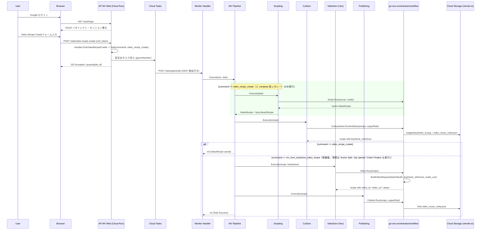

# 🎬 AP MV (AP Music Video Orchestrator)

[](https://github.com/shouni/ap-mv/actions/workflows/ci.yml)
[](#)
[](https://golang.org/)
[](https://cloud.google.com/run)
[](https://opensource.org/licenses/MIT)

## 🚀 概要 (Overview) - 楽曲同期型・連鎖動画オーケストレーター

**AP MV (AP Music Video Orchestrator)** は、**Music Recipe（音楽レシピ / 楽曲構成書）** から時間軸のタイムラインを自動補完・構造化し、Google の動画生成 AI **Veo (Vertex AI)** と Gemini 系モデルによる台本生成・キーフレーム生成をつなぐ、Cloud Run / Cloud Tasks 前提の非同期オーケストレーターです。

Web UI からの非同期受付、Cloud Tasks による worker 起動、外部モジュール `github.com/shouni/go-veo-orchestrator` の workflow による Script / Keyframe / Video / Publish の実処理、そして **Image-to-Video（キーフレーム＋キャラ立ち絵を起点とした動画生成）** と **Video-to-Video（動画ID連鎖）** による文脈維持をひとつのアプリケーションとして構成します。

「時間軸のタイムライン制御（Timeline Logic）」へと進化させ、映像指示、BGMの拍子・感情・盛り上がり（Audio Cue）がミリ秒単位で完全にシンクロした商業クオリティの映像パイプラインを提供します。

生成済みジョブは `/web/history` から確認できます。GCS 上の `video_music_meta.json` をページング一覧し、詳細画面 `/web/history/{jobID}` では各 cut の `keyframe_reference` を署名付き URL に変換してキーフレーム画像を表示します。

---

## ✨ コア・アーキテクチャ・原則 (Design Principles)

本システムは、外部サービス境界には ports/adapters による疎結合を維持しつつ、生成処理の本体はデータ変換の流れが追いやすい **「パイプ＆フィルター (Pipe and Filter)」** として構成しています。

また、Web UI からの受付と重い生成処理を分離するため、Cloud Tasks を用いた **非同期タスク駆動 (Task/Event-Driven) Worker Execution** を採用し、タイムアウトしやすい動画生成バッチを安全に継続・再実行できる構成にしています。

### 🧬 クアッド・ファクター・コンシステンシー制御 (Consistency Control)

動画AI（Veo）における最大の課題である「カットごとの容姿・文脈の破綻」を防ぐため、以下の4大要素を同期させて1つのリクエストを決定論的に構築します。

* **Seed-Based Determinism**: キャラクター固有 Seed 値の完全管理による再現性の担保。
* **Keyframe Anchor (Image-to-Video)**: `gemini-image-kit` を応用。キャラクター Seed と参照画像から、ブレのない静止画キーフレームを高精度生成し、Veo へ Image-to-Video 入力として渡します。キャラ立ち絵は `referenceImages`（優先）、キーフレームは `image` としてそれぞれ Veo API にセットされます。
* **Audio-Driven Prompting**: Music Recipe の `audio_cue`（例: `synchronized with the heavy bass drop at 0:10`）を Veo 用プロンプトへ自動インジェクション。
* **Context Chain (Video-to-Video)**: 前のループで生成された `VideoID` を次カットの `PreviousVideoID` として数珠繋ぎに連鎖させ、カット間の文脈を極限まで維持。Veo の video_extension は前回の生成結果を条件入力として再利用する性質上、継続を重ねるたびに彩度・コントラストがドリフトして蓄積するため（実運用で確認済み）、各世代の出力をそのカットのシーン用キーフレーム画像へ彩度補正で引き戻し（`internal/worker/filter/video_gen.go` の `colorCorrectExtensionCut`）、補正後の動画を次カットの `PreviousVideoID` として連鎖させます。

### 🔁 Resumable Video Chain (レジューム機能)

動画生成パイプラインは極めて重い処理であるため、各 `cut` は `status`、`video_id`、`video_url` をメタデータとして保持します。生成済み状態を含む `video_music_meta.json` または Recipe を再投入した場合、`status=generated` のカットをスキップし、保持済みの `video_id` を次カットの `PreviousVideoID` に引き継げます。これにより、生成済みメタデータを起点に途中カットから再開しやすい回復性（Resilience）を備えています。

`VEO_USE_PREVIOUS_VIDEO=true` の場合はさらに一歩進み、`VideoGenerationFilter` が1カットずつ Veo へリクエストを送るたびに、残りカットが残っていれば内部コマンド `video_gen_continuation` で自身の続きタスクを Cloud Tasks へ再投入し、当該タスクは `ErrPipelineDeferred` として即座に終了します（`internal/worker/pipeline/planner.go` の `DefaultPlanner.Plan` は `video_gen_continuation` を Video Gen → Chain Finalize → Publishing のみのフィルター列として扱い、Recipe Load/Scripting/Keyframe Gen は再実行しません）。生成先カットの尺は video_extension（video-to-video）専用のサポート値である7秒固定へ正規化されます（`internal/worker/filter/veo_cut_utils.go` の `veoVideoExtensionDurationSec`）。この分割enqueueにより、Cloud Tasks 1回あたりの実行時間制限内で長尺MVでも安全に最後まで生成を継続できます。

継続チェーンの累積尺が `veoContinuationMaxDurationSec`（24秒、`internal/worker/filter/veo_cut_utils.go`）に達する手前で、自動的に新しいチェーンへリセットします（Veo の video_extension が「前の動画」として受け付けられる実際の上限は累積約30秒で、超えると `code=3` で失敗するため、余裕を持って手前で切ります）。リセットされたカットは `PreviousVideoID` を使わない新規ベース（image_to_video または reference_to_video）として、直前チェーンの最終フレーム（`ExtractLastFrame` で抽出）を参照画像に差し替えて生成されます。

### ⛓ Cloud Tasks Worker Execution

Web UI はリクエストを Cloud Tasks に投入し、worker ルート `/tasks/generate` が OIDC 検証後に pipeline を実行します。現在の実処理は `go-veo-orchestrator/workflow` に集約しており、Script / Cut Keyframe / Video / Publish の各 runner を worker 実行内で順に呼び出します。`status=generated` のカットは `VideoTimelineRunner` 側でスキップされ、保持済みの `video_id` を次カットの `PreviousVideoID` として引き継ぎます。

完了通知では `SERVICE_URL` が設定されている場合、Slack メッセージに History Detail へのリンクも含めます。

### ⏳ Audio-Driven Timeline Logic (柔軟なタイムライン展開)

原稿から抽出された `MusicRecipe` JSON が `sections` ベース（長尺セクション単位）で届いた場合でも、`go-gemini-client/lyria.MusicRecipe` の `duration_seconds` から `go-veo-orchestrator/ports.VideoRecipe` の `cuts` 列（秒数、開始・終了時間）を自動計算・展開。テンポ（`tempo`）や雰囲気（`mood`）に同期したタイムラインを動的に組み立てます。

### 🛡 エンタープライズ・コンカレンシー & 防壁 (Security Layer)

* **Token-Bucket & Bounded Concurrency**: `golang.org/x/time/rate` と `errgroup.SetLimit` によるキーフレーム生成の流量制御と同時実行数制御を行い、生成系 API のレートリミットを避けます。
* **Network Safety**: 外部HTTP取得には `go-http-kit` 系の安全な HTTP client を注入し、GCS 入出力は `go-remote-io` の GCS adapter に集約します。`SERVICE_URL` は `netarmor` による安全スキーム判定を通し、本番では HTTPS を必須化します。
* **Singleflight Protection**: 大容量の動画・音声アセットの重複フェッチや二重アップロードをインメモリで完全に抑制。
* **Session-backed CSRF**: WebフォームのCSRFトークンは `gorilla/sessions` のCookieセッションに保存し、POST / DELETE 時に定数時間比較で検証します。フォーム送信は `csrf_token` フィールド、JS からの fetch（DELETE など）は `X-CSRF-Token` ヘッダーで渡します。Cookie署名キーには起動時ランダム値ではなく `SESSION_SECRET` を使うため、Cloud Run の再起動や複数インスタンス間でも検証が安定します。

---

## 🎨 ワークフローと生成フィルター (Workflows)

`internal/worker/filter/` 配下の各フィルターは、`domain.MusicRecipe`（`go-gemini-client/lyria.MusicRecipe` alias）と `go-veo-orchestrator/ports.VideoRecipe` を変換しながら、`go-veo-orchestrator/workflow` の runner を呼び出します。動画生成の `cuts`、`video_id`、`keyframe_reference` などの状態は `VideoRecipe` 側で保持します。

実行するフィルター列はコマンドごとに `internal/worker/pipeline/planner.go` の `DefaultPlanner.Plan` が決定します:

| コマンド | 主な投入元 | フィルター列 |
| --- | --- | --- |
| `video_recipe_draft` | `/web/compose-draft`（作成フォームの「下書きだけ作る」）、ap-mcp の `compose_video_recipe` | Scripting → Scene Split → Draft Save（**キーフレームを1枚も焼かずに停止**） |
| `video_recipe_create` | `/web/video-recipe-create`（`/web/compose` も同じフォーム）、ap-mcp | Scripting → Scene Split → Cut Keyframe Gen → Zip Upload（キーフレームまでで停止） |
| `mv_from_keyframe_video_recipe` | `/web/mv-from-keyframe-video-recipe`（M2M）、履歴詳細の動画生成フォーム（`target=full`） | Recipe Load → Scene Split → Cut Keyframe Gen → Zip Upload → Video Gen → Chain Finalize → Publishing |
| `short_video_from_section` | 履歴詳細の動画生成フォーム（`target=<セクション>`） | Recipe Load → Section Select → Video Gen → Chain Finalize → Publishing |
| `regenerate_cut_keyframe` | 履歴詳細の Regenerate 画面 | Recipe Load → Regen Cut Keyframe → Zip Upload |
| `regenerate_zip` | `POST /web/history/{jobID}/regenerate-zip` | Recipe Load → Zip Upload |
| `regenerate_cut_video` | 履歴詳細の各カットの「動画を作り直す」、ap-mcp の `regenerate_cut_video` | Recipe Load → Cut Video Select → Video Gen → Chain Finalize → Publishing（**scene_split は通さない**） |
| `video_gen_continuation` | `VideoGenerationFilter` が内部的に enqueue | Video Gen → Chain Finalize → Publishing |

各フィルターの役割は次のとおりです（表の並びはフルMVチェーンの実行順。末尾2つはコマンド専用フィルター）:

| フィルター工程 | 担当モジュール | 役割・内容 |
| --- | --- | --- |
| **Recipe Load** | `recipe_load.go` | 履歴詳細の動画生成フォームや M2M（`POST /web/mv-from-keyframe-video-recipe`）で指定された Keyframe VideoRecipe GCS URL / JSON または従来の MusicRecipe GCS URL / JSON を読み込み、pipeline 内の Recipe / VideoRecipe として正規化します。この経路では `Scripting` をスキップし、Keyframe VideoRecipe から MV 生成へ進みます。 |
| **Scripting** | `scripting.go` | `/web/video-recipe-create` の videoレシピ作成フローで `Workflows.Script.Run` を呼び、Character、MusicRecipe GCS URL / JSON、Visual Mode 的プロンプトから Video Recipe を生成します。テキスト入力は `data:text/plain;base64,...` として reader に渡します。 |
| **Scene Split** | `scene_split.go` | キーフレーム生成の前に、1カットがVeo1回で生成できる尺に収まるよう長いカットを分割します（`SceneSplitFilter`、`UsePreviousVideo` は `VideoGenerationFilter` と同じ値を渡す必要があります）。`UsePreviousVideo=false`（静止画アンカー方式）の場合は `{4,6,8}` 秒単位に分割し、各サブカットの `audio_cue`/`visual_anchor`/歌詞行を均等配分します。`UsePreviousVideo=true`（動画チェーン方式）の場合は 1本の継続チェーンとして生成できる合計尺の候補（`videoToVideoChainDurations`。image_to_video ベースなら `{4,6,8,11,13,15,18,20,22}`、reference_to_video ベースなら `{8,15,22}`。値はライブラリの `orchestrator.ChainDurations` がベース尺と継続上限から導出するため、ここにハードコードされた集合はありません）へ `allocateChainDurations` が誤差拡散で割り付け、2つ目以降のブロックには `IsSectionStart=true` を付与して独立したキーフレーム/継続チェーンの起点として扱います。分割後の `Cuts` は `CutIndex` を1から振り直し、それぞれが次段の Cut Keyframe Gen で個別にキーフレームを受け取ります。 既にキーフレームを持つカットが1ブロックへそのまま再割り当てされた場合は `keyframe_reference` を残し（次段の Cut Keyframe Gen が焼き直しを省けます）、複数ブロックへ割れた場合は破棄します（1枚の絵が scene beat の異なる複数カットに対応してしまうため）。同じレシピを二度通しても結果が変わらないこと（冪等性）は `TestSceneSplitFilterIsIdempotent` が固定しています。 |
| **Cut Keyframe Gen** | `cut_gen.go` | `Workflows.CutKeyframe.RunAndSave` を呼び、各カットのキーフレーム画像と更新済み `video_music_meta.json` を GCS に保存します。**`keyframe_reference` を持つカットは焼き直されません**（判定は `CutKeyframeRunner.RunAndSave` 側。go-veo-orchestrator v1.10.0 以降）。履歴詳細の「動画生成→フルMV」は `Recipe Load → Scene Split → Cut Keyframe Gen` を通るため、これが無いと動画を作り直すたびに画像代を払うことになります。参照が正しい形で下流へ届くことは ap-mv 側の担当で、`Scene Split` が 1:1 再割り当て時に参照を残し、`Recipe Load` が元ジョブ相対の参照を絶対 URI 化します。意図的に焼き直すには `regenerate_cut_keyframe` / `regenerate_section_keyframes` を使います（キャラクターの参照画像やシードの変更を反映するにはこちらが必要で、動画の作り直しでは反映されません）。保存後に `applyLyricsToVideoRecipeCuts` を実行し、`music_recipe.lyrics.lyrics` をセクション単位で分解して各カットの `dialogue` フィールドへ割り当てます。 |
| **Zip Upload** | `zip_upload.go` | 生成済みキーフレーム、`inputs.txt`、`subtitles.ass`（歌詞がある場合）を ZIP にまとめ `{outputPath}keyframes.zip` へストリーミングアップロードします。`regenerate_cut_keyframe` コマンドでは `OverwriteKeyframe=true` のときのみ実行し、`regenerate_cut_keyframe` / `regenerate_zip` コマンドでは元ジョブの出力パスを `RecipeURL` から逆算して上書きします。 |
| **Video Gen (Veo)** | `video_gen.go` | `Workflows.Video.Run` を呼び、キーフレーム、音源の GCS URI（`Music Audio GCS URL` または `VideoRecipe.cuts[].audio_reference`）、プロンプト、`PreviousVideoID`、Seed を `VertexVeoRunner` へ渡します。音源同期させる場合は `gs://...mp3` / `gs://...wav` などの参照可能な GCS URI が必要です。`VideoTimelineRunner` 単体では保存済み `keyframe_reference` を利用できますが、現在の ap-mv pipeline は前段の `CutKeyframeFilter` でキーフレーム生成・保存を実行します。`VEO_USE_PREVIOUS_VIDEO=true` の場合の挙動は上記の Resumable Video Chain 節を参照してください。 |
| **Veo Usage 記録** | `veo_usage.go` | Video Gen がカット1本を生成し終えるたび（＝課金が発生した直後）に `{outputPath}veo_usage.json` を read-modify-write し、成功した生成の回数・尺・モデルをカット単位で積み上げます。`video_music_meta.json` から算出できるのは「完成品の尺」だけで、再配信などで同じカットを焼き直した分は完成品に現れないため、実際に投げた量はここでしか分かりません。両者の差が再生成で捨てた分として履歴詳細に表示されます。記録の失敗は警告ログのみで生成は続行します（会計のために生成を止めると、既に課金済みのカットを Cloud Tasks が焼き直しにくるため）。ジョブが同時に2つ走ると更新を取りこぼしうるので、実績は過小になる可能性があります。 |
| **Chain Finalize** | `chain_finalize.go` | 全カット生成完了後（Video Gen が `ErrPipelineDeferred` を返さず正常終了した回のみ）、Video Gen → Publishing の間で1度だけ実行されます。各継続チェーンの最終カット動画（次カットが `IsChainStart` の位置、`video_gen.go` のマーキングと対）を登場順に集め、`VideoProcessor.ConcatHardCut`（FFmpeg）でハードカット結合して `FinalVideoURL` に設定します。結合後は `VideoProcessor.Probe` で完成動画の実尺と音声トラックの有無を実測し、台本の総尺と食い違う場合や無音の場合は警告ログを残します（動画自体は生成できているためジョブは失敗させません）。動画生成を伴わないコマンド（キーフレームのみのパス）には含まれません。 |
| **Publishing** | `publishing.go` | `Workflows.Publish.Run` を呼び、最終的な `video_music_meta.json` を GCS に保存します。 |
| **Regen Cut Keyframe** | `regen_cut_keyframe.go` | `regenerate_cut_keyframe` コマンド専用。指定カット（`CutIndex`）のキーフレームのみ再生成・編集します。`EditPrompt` が指定されている場合は「編集モード」となり、既存の `keyframe_reference` を編集元画像として `CutKeyframe.EditAndSave`（内部的には `gemini-image-kit` の `GenerateSingleImage` に既存画像を入力として渡す会話型編集、通常生成と同じ `IMAGE_MODEL` を使用）を呼び、構図・ポーズ・背景を保ったまま指示内容だけを反映します（このとき `VisualAnchorOverride` は無視されます）。`EditPrompt` が空の場合は「フル再生成モード」で、`VisualAnchorOverride` が指定されていれば対象カットのプロンプト文言（`visual_anchor`）を差し替えたうえで `CutKeyframe.RunAndSave` を実行します。`SeedOverride`/`SeedOverrideCharacterID` が指定されている場合、どちらのモードでもこの 1 回に限りキャラクターシードを一時的に差し替えます（他カットとの一貫性は崩れうるため一時的な用途向け）。`OverwriteKeyframe=true`（デフォルト）の場合は recipe の `keyframe_reference`（フル再生成モードでは `visual_anchor` も）を更新して `Publish.Run` で metadata を上書き保存します。 |
| **Draft Save** | `draft_save.go` | `video_recipe_draft` コマンド専用。Scene Split を通したあとの `VideoRecipe` を `gs://<AP_MV_BUCKET>/<VEO_OUTPUT_PREFIX>/drafts/<jobID>/video_recipe_draft.json` に保存し、キーフレーム生成の手前でパイプラインを終わらせます。保存するのが Scripting 直後ではなく Scene Split 後なのは、台本直後のカット列は尺が未確定（Scene Split が達成可能なチェーン長へ割り付け、丸め誤差を次カットへ送り、`StartSec`/`EndSec` を連結後の映像タイムラインへ振り直す）で、見せても実際に焼かれるカット割りとは別物になるためです。保存前に `domain.ValidateVideoRecipe` を通し、下書きとしては読めるがキーフレーム生成で落ちるレシピが一覧に残らないようにします。 |
| **Cut Video Select** | `cut_video_select.go` | `regenerate_cut_video` コマンド専用。保存済みレシピの全カットを残したまま、対象カット（`CutIndex`）の生成状態だけを初期化して動画生成の対象へ戻します。キーフレームは元ジョブのものをそのまま使い（相対参照は元ジョブのルートで絶対URI化）、作り直さないカットは `status=generated` のままなので `VideoTimelineRunner` がスキップし、`ChainFinalizeFilter` が既存の動画と合わせて1本へ結合し直します。`UsePreviousVideo=true`（継続チェーン方式）では、対象カットの動画を差し替えるとそれを `PreviousVideoID` として参照する後続カットの入力が古くなるため、**次のチェーン起点の手前までをまとめて初期化します**（対象がチェーン末尾なら1カットだけ）。`SectionSelectFilter` と違ってカットを絞り込まないのは、完成動画が全カットの結合だからです（絞り込むとその部分だけのショート動画になります）。 |
| **Section Select** | `section_select.go` | `short_video_from_section` コマンド専用。保存済みレシピのカット列を、`SectionIndex` で指定されたセクション（`start_seconds`〜`end_seconds` に `StartSec` が含まれるカット群）だけへ絞り込みます。絞り込んだカットは生成状態（`status` / `video_id` / `video_url`）を初期化し、相対 `keyframe_reference` は元ジョブのルートで絶対 URI 化します。Veo の image_to_video はカット尺 4/6/8 秒のみサポートするため、8 秒超のカット（キーフレームのみ生成したレシピはセクション尺のままのことがある）は同じキーフレームを引き継いだサブカット列へ分割し、各尺をサポート値に丸め、歌詞は行単位でサブカットへ均等配分します（`CutIndex` は 1 から振り直し。この尺の正規化は Video Gen フィルタでフルMVフローにも適用され、生成済みカットは変更されません）。さらにショートは YouTube ショートの上限 60 秒に収まるよう超過カットを切り詰めます。後段は通常の Video Gen → Publishing が新規ジョブとして実行され、タスクの `veo_model` / `veo_aspect_ratio`（例: `9:16`）が `VertexVeoRunner` に適用されます。 |

### Recipe / Audio GCS Inputs

| 入力 | 場所 | 内部フィールド | 用途 |
| --- | --- | --- | --- |
| Keyframe VideoRecipe JSON | `/web/mv-from-keyframe-video-recipe` の `Keyframe VideoRecipe JSON` | `Task.VideoRecipe` | keyframe_reference を含む VideoRecipe から MV 生成を開始します。 |
| Keyframe VideoRecipe GCS URL | `/web/mv-from-keyframe-video-recipe` の `Keyframe VideoRecipe GCS URL` | `Task.RecipeURL` | `gs://.../video_music_meta.json` を worker の `RecipeLoadFilter` が読み込みます。 |
| MusicRecipe JSON | `/web/mv-from-keyframe-video-recipe` の JSON 入力 | `Task.Recipe` | 互換入力です。VideoRecipe に変換して `Scripting` をスキップします。 |
| MusicRecipe GCS URL | `/web/video-recipe-create` の `MusicRecipe GCS URL` | `Task.SourceURL` | VideoRecipe 作成の入力です。`gs://.../music_recipe.json` を `Workflows.Script.Run` に渡します。 |
| MusicRecipe GCS URL | `/web/mv-from-keyframe-video-recipe` の GCS URL | `Task.RecipeURL` | 互換入力です。`gs://.../music_recipe.json` を worker の `RecipeLoadFilter` が読み込みます。 |
| Music Audio GCS URL | `/web/mv-from-keyframe-video-recipe` の `Music Audio GCS URL` | `Task.AudioURL` | 全 cut の空の `audio_reference` に補完され、`VertexVeoRunner` の `audio.gcsUri` として送られます。 |
| Cut別 Audio URI | VideoRecipe JSON の `cuts[].audio_reference` | `Task.VideoRecipe.Cuts[].AudioReference` | cut ごとに異なる音源セグメントを指定したい場合に使います。`Task.AudioURL` より優先されます。 |

---

## 🔌 Veo Adapter Boundary

Veo API への実通信は **`ports.VideoRunner`** インターフェースに分離しています。`ports.VideoRunner` / `VideoGenerationRequest` / `VideoResponse` は `github.com/shouni/go-veo-orchestrator` の型を alias しており、オーケストレーター側の契約と同じ形で扱います。

Cloud Run 実行では `internal/adapters.VertexVeoRunner` を DI します。ローカル専用モードは持たず、Cloud Run 上で OAuth / Cloud Tasks / Veo 経路を確認する前提です。

### `VertexVeoRunner` の責務

* Application Default Credentials で `https://www.googleapis.com/auth/cloud-platform` の OAuth token を取得
* Vertex AI Veo の `:predictLongRunning` にリクエストを送信
* `:fetchPredictOperation` をポーリングし、完了した `gcsUri` を取得
* OAuth2 HTTP クライアントには30秒の単一リクエストタイムアウトを設定
* ポーリング中の一時的な通信エラーは連続10回まで許容
* `ImageReference` がある場合は `image.gcsUri` として投入
* 前カットの `VideoID` が `gs://...mp4` の場合は `video.gcsUri` として投入し、Video-to-Video 連鎖を維持
* 生成結果の `gcsUri` を `VideoResponse.CloudURL` と `VideoResponse.VideoID` に返し、次カットへ引き継ぐ

### Runtime Environment Variables

| 変数 | デフォルト | 用途 |
| --- | --- | --- |
| `PORT` | `8080` | HTTP server の listen port |
| `LOG_LEVEL` | `INFO` | ログ出力レベル（`DEBUG` / `INFO` / `WARN` / `ERROR`）。ログは Cloud Logging が解釈する `severity` / `message` 形式で出力され、`X-Cloud-Trace-Context` があればリクエスト単位でトレースに紐付きます |
| `SERVER_ROLE` | なし（必須） | このプロセスが担う役割。`web` / `worker` / `both`。未設定と未知の値は起動時エラーです。詳細は「web / worker の分離」節を参照 |
| `SERVICE_URL` | `http://localhost:8080` | OAuth callback、Cloud Tasks worker URL の導出、Slack の History Detail リンクに使う**公開**URL。web/worker を分けた場合、worker にも**非公開の worker 自身ではなく web の URL**を設定します（Slack のリンクがこの値から作られるため） |
| `GCP_PROJECT_ID` | なし | Vertex AI、Cloud Tasks、Gemini Vertex 経路で使う GCP project |
| `GCP_LOCATION_ID` | なし | Vertex AI / Gemini の location |
| `AP_MV_BUCKET` | なし | workflow 出力、Recipe 読み込み、History repository が使う GCS bucket。`my-bucket` / `gs://my-bucket` のどちらも可 |
| `AP_MUSIC_BUCKET` | `ap-music` | Video Recipe Create フォームの Music Job ID から `gs://<AP_MUSIC_BUCKET>/music/<jobID>/recipe.json`（ap-comp と同じ規則）を解決するための GCS bucket |
| `GEMINI_MODEL` | `gemini-3.6-flash` | 台本生成などのテキスト生成モデル。未設定時は `GEMINI_MODELS` の先頭を使います |
| `GEMINI_MODELS` | `gemini-3.6-flash` | Web UI の Gemini Model 選択肢 |
| `IMAGE_MODEL` | `gemini-3.1-flash-image` | 標準キーフレーム生成モデル。未設定時は `IMAGE_MODELS` の先頭を使います |
| `IMAGE_MODELS` | `gemini-3.1-flash-image` | Web UI の Image Model 選択肢 |
| `WORKER_URL` | `<SERVICE_URL>/tasks/generate` | Cloud Tasks が呼び出す worker endpoint。**worker 自身にも設定が必要**です（カット分割された動画生成が次のカットを自分で積み直すため） |
| `TASK_AUDIENCE_URL` | `SERVICE_URL` | Cloud Tasks OIDC token の audience。web/worker を分けた場合は**呼び先である worker サービスの URL**を明示指定します（Cloud Run の IAM が audience 不一致を 403 で弾くため） |
| `CLOUD_TASKS_QUEUE_ID` | なし | Cloud Tasks queue ID |
| `TASK_CALLER_SERVICE_ACCOUNT_EMAIL` | なし | 投入するタスクの `oidcToken.serviceAccountEmail` に指定する caller SA。トークンを生成して付与するのは Cloud Tasks であって、このサービスではありません。ap-mv は worker も継続カットを投入するため、どちらの役割でも必要です。必須です（旧 `SERVICE_ACCOUNT_EMAIL` へのフォールバックは撤去済み） |
| `ALLOWED_TASK_SERVICE_ACCOUNTS` | なし（worker で必須） | worker が**受け付ける** caller SA の許可リスト（カンマ区切り）。web と worker で caller SA が別になるため 2 件必要です（ap-mv は worker も継続カットを投入するため） |
| `VEO_MODEL` | `veo-3.1-generate-001` | Vertex AI Publisher Model ID。未設定時は `VEO_MODELS` の先頭を使います |
| `VEO_MODELS` | `veo-3.1-generate-001` | Web UI（ショート動画生成フォーム等）の Veo Model 選択肢 |
| `VEO_LOCATION_ID` | `GCP_LOCATION_ID` の値 | Veo API を呼び出す Vertex AI location。`global` も指定可能（グローバルエンドポイント `aiplatform.googleapis.com` を使用）。Veo は提供リージョンが限られるため、データ所在地の要件がなければ `global` を、リージョン固定が必要なら `us-central1` 等を指定します |
| `VEO_OUTPUT_PREFIX` | `ap-mv/veo` | Veo 生成物の GCS 出力 prefix |
| `VEO_ASPECT_RATIO` | `16:9` | `16:9` または `9:16`。タスク側の指定（ショート動画生成の `veo_aspect_ratio`）があればそちらを優先 |
| `VEO_GENERATE_AUDIO` | `false` | Veo 3 系の `generateAudio` 指定。別途音楽トラックを合成する場合は `false` を推奨 |
| `VEO_POLL_INTERVAL` | `10s` | long-running operation のポーリング間隔 |
| `VEO_OPERATION_TIMEOUT` | `20m` | 1カット生成の最大待機時間 |
| `PIPELINE_TIMEOUT` | `45m` | ワーカータスク1件の実行時間の上限。フィルター列全体（レシピ生成・キーフレーム・動画生成・公開）を包む上限で、超過したタスクは `failed` として記録され Cloud Tasks の再試行で作り直せます。カット分割された継続タスクにはそれぞれ個別に適用されます |
| `VEO_POLL_MAX_ERRORS` | `10` | `fetchPredictOperation` ポーリングが連続失敗してよい最大回数。超えるとカット生成を失敗として扱います |
| `VEO_USE_PREVIOUS_VIDEO` | `false` | `true` の場合、先頭カット以降を Veo の video_extension（video-to-video、前カットの動画を `PreviousVideoID` として引き継ぐ生成）専用のサポート尺である7秒固定に正規化し、image_to_video 用の keyframe/referenceImages ではなく前カット動画を入力として動画生成します。詳細は下記の Resumable Video Chain 節を参照 |
| `VEO_PRICE_USD_PER_SEC` | `veo-3.1-generate-001:0.40,veo-3.1-fast-generate-001:0.15,veo-3.0-generate-001:0.75,veo-3.0-fast-generate-001:0.40,veo-2.0-generate-001:0.50` | 履歴画面に出す概算コストの単価表（`モデル名:USD/生成1秒` をカンマ区切り）。空キー（`:0.40`）は表に無いモデルへのフォールバック。既定値は目安であり、実際の単価はモデル・`VEO_GENERATE_AUDIO`・契約で変わります。**請求額と一致することは保証しません**（用途はジョブ間の比較と再生成による無駄の検出）。正確な値は Vertex AI の価格表を確認して上書きしてください |
| `KEYFRAME_MAX_CONCURRENCY` | `1` | キーフレーム生成の同時実行数（`errgroup.SetLimit`） |
| `KEYFRAME_RATE_INTERVAL` | `60s` | キーフレーム生成のレート制御間隔（`golang.org/x/time/rate`） |
| `SHUTDOWN_TIMEOUT` | `15s` | graceful shutdown の待機時間 |
| `SLACK_WEBHOOK_URL` | なし | 設定時に完了/失敗通知を Slack Incoming Webhook へ送信 |

Cloud Run 実行では `SERVICE_URL` / `WORKER_URL` に HTTPS が必須です。実行サービスアカウントは web / worker で分かれており、必要な権限も異なります。

| | `ap-mv-web-runner` | `ap-mv-worker-runner` |
| --- | --- | --- |
| `AP_MV_BUCKET` | 読み書き | 読み書き |
| `AP_MUSIC_BUCKET` | 不要（`gs://` の URI を組み立てるだけ） | **読み取り**（`music_job_id` から `recipe.json` を読む） |
| Vertex AI | 不要 | 必要（Veo / Gemini） |
| Cloud Tasks 投入 | 必要 | **必要**（継続カットの自己投入） |
| 自分自身への `iam.serviceAccountTokenCreator` | 必要（署名付き URL） | 必要 |

worker も投入側になるため、worker の `ALLOWED_TASK_SERVICE_ACCOUNTS` には 2 つの SA を両方並べてください。権限定義は `ap-infra` リポジトリの `app_ap_mv.tf` にあります。

### Web Security Environment Variables

| 変数 | 用途 |
| --- | --- |
| `SESSION_SECRET` | OAuth セッションおよびCSRF CookieセッションのHMAC署名キー。productionでは必須。Cloud Run の全インスタンスで同じ値を設定してください。 |
| `SESSION_ENCRYPT_KEY` | OAuth セッション暗号化キー。productionでは必須。16 / 24 / 32 bytes のいずれか。 |
| `GOOGLE_CLIENT_ID` | Google OAuth クライアントID |
| `GOOGLE_CLIENT_SECRET` | Google OAuth クライアントシークレット |
| `ALLOWED_EMAILS` | ログインを許可するメールアドレスのリスト |
| `ALLOWED_DOMAINS` | ログインを許可するドメインのリスト |
| `ALLOWED_M2M_SERVICE_ACCOUNTS` | `/web/*` エンドポイントを OIDC Bearer トークン（`Authorization: Bearer <ID Token>`, audience=`SERVICE_URL`）で呼び出せるサービスアカウントのメールアドレス一覧（カンマ区切り）。未設定の場合、サーバー間通信は常に拒否されます |

M2M 認証が成功したリクエストは CSRF 検証をバイパスします。

`server.Run` は起動時に `ValidateEssentialConfig()` を実行します。検証範囲は `SERVER_ROLE` に従い、`SESSION_SECRET` / `SESSION_ENCRYPT_KEY` / OAuth 設定 / 認可リストは **Web 面を提供する場合のみ**必須です。Cloud Tasks 設定・GCS・Veo 設定はどちらの役割でも必須になります。

### History Storage

生成履歴は `AP_MV_BUCKET` と `VEO_OUTPUT_PREFIX` から構築される `gs://<AP_MV_BUCKET>/<VEO_OUTPUT_PREFIX>/jobs/` 配下を参照します。ジョブごとの `video_music_meta.json` を一覧対象とし、詳細画面では同じ JSON の `cuts[]` から keyframe / video / status などを表示します。

**下書き**（`video_recipe_draft`）は同じバケットの兄弟プレフィックス `gs://<AP_MV_BUCKET>/<VEO_OUTPUT_PREFIX>/drafts/<jobID>/video_recipe_draft.json` に保存します。`jobs/` 配下に置かないのは、履歴一覧の走査（`video_music_meta.json` を目印にする）とジョブ削除（プレフィックス一括削除）の対象範囲が重なるためです。下書きは `/web/drafts` の一覧にのみ現れ、`list_video_history` には出ません。ジョブ ID の用途プレフィックスも `video-draft-` で分けているため、ID だけでどちらのものか判別できます。

**履歴一覧**（`ListHistoryPage`）は、多数の job を毎回読み直すコストを抑えるため、metadata JSON を短時間 TTL cache に保持します。**履歴詳細**（`GetHistory`）と**キーフレームダウンロード**（`DownloadKeyframes`）は、regenerate/編集ジョブ完了直後に最新状態を確認したいケースで stale なキャッシュを返さないよう、常に GCS から直接読み込みます（キャッシュを一切経由しません）。Cloud Run が複数インスタンスで動く場合、ワーカーインスタンスでのキャッシュ無効化が他インスタンスの一覧キャッシュには届かないことがありますが、詳細・ダウンロードは常に最新なので実害はありません。署名付き URL は表示ごとに生成し、期限付き URL 自体は cache しません。

---

## 🔀 タスク固有の Workflows

`workflow.New` で組み立てた orchestrator の `Workflows` はプロセス全体で共有しますが、
タスクがモデル（`TextModel` / `ImageModel`）・シード・Veo 設定（`VeoModel` / `VeoAspectRatio`）を
上書きしている場合だけ、そのタスク専用の `Workflows` を構築して使います
（`internal/builder` の `workflowResolver`）。

判定と構築を1か所に閉じているため、タスク固有オプションを増やすときはここだけを変更すれば済みます。

**専用に構築した `Workflows` はタスク完了時に `Close()` します。** `workflow.New` は
画像キャッシュのクリーンアップ goroutine を起こすため、閉じ忘れるとジョブごとに goroutine が
積み上がります。共有インスタンスは閉じてはいけないので、`Resolve` は Workflows と一緒に
後始末用の関数を返し、呼び出し側はそれを `defer` します（どちらを受け取ったかは
呼び出し側から判別できないため、後始末を返せるのは解決した側だけです）。

---

## 📂 プロジェクト構造 (Project Structure)

データフローの時系列に沿って綺麗にパッキングされ、無駄な階層移動を極限まで削ぎ落とした洗練されたフォルダレイアウトです。

```text
ap-mv/
├── main.go                 # エントリーポイント
├── Dockerfile              # Cloud Run 向け FROM scratch コンテナ定義
├── assets/                 # embed.FS で配布する静的・プロンプト資産
│   ├── prompts/            # VideoRecipe 生成・Visual Mode・Veo動画生成モード別（image_to_video / reference_to_video / video_extension）のプロンプトテンプレート
│   └── templates/          # Web UI テンプレート（compose / recipe / history / history_detail）
└── internal/
    ├── adapters/           # 外部サービス連携（Vertex AI Veo adapter, Slack, ffmpeg）
    │   └── prompt/         # Gemini へ送るプロンプト組み立て（台本・キーフレーム）
    ├── app/                # DI container（RemoteIO は remoteio.Bundle の別名）
    ├── builder/            # config から container / handlers / workflow / pipeline を構築（配線のみ）
    ├── config/             # caarlos0/env による環境変数ロードと設定検証（Veo/GCS/OAuth等）
    ├── domain/             # タスクモデルと music/video recipe 型 alias、job_id検証
    ├── ports/              # アプリ内境界。VideoRunner は go-veo-orchestrator の型 alias
    ├── repository/         # GCS 上の video_music_meta.json を一覧・詳細取得・削除する履歴 repository
    ├── server/              # chi ルーティング、OAuth、CSRF、Cloud Tasks OIDC、HTTP server起動
    │   └── handlers/       # Web UI / task handler / CSRF context
    └── worker/
        ├── pipeline/       # Task command から filter chain を実行
        └── filter/         # go-veo-orchestrator/workflow runner を呼ぶ各処理フィルター（実行順はコマンドごとに pipeline/planner.go が決定。詳細は後述の Workflows 表を参照）

```

---

## 🔄 シーケンスフロー (Sequence Flow)



---

## 🚀 使い方 (Usage)

### 1. videoレシピ作成

1. Google OAuthで安全にログインします。
2. `/web/video-recipe-create` から `MusicRecipe GCS URL`、Visual Mode、Character、利用モデルを選んで送信します。Web handler は Cloud Tasks に投入し、`202 Accepted` と `job_id` を返します。POST handler は互換入力として `text` / `image_url` も受け付けますが、現在のフォームに表示される主入力は `music_recipe_url` です。
3. Cloud Tasks から `/tasks/generate` が呼ばれ、OIDC 検証後に pipeline が起動します。`video_recipe_create` では `Scripting -> Scene Split -> Cut Keyframe Gen -> Zip Upload` の順に進み、セクション単位の keyframe を含む VideoRecipe を `gs://<AP_MV_BUCKET>/<VEO_OUTPUT_PREFIX>/jobs/<jobID>/video_music_meta.json` に保存します。

### 1-b. 下書きで確認してから進める

キーフレーム画像はカット数ぶん生成されるため、カット割りが的外れだとその枚数がまるごと無駄になります。確認してから進めたい場合は次の順で操作します。

1. 作成フォーム（`/web/video-recipe-create`）で入力し、**「下書きだけ作る」** を押します（`POST /web/compose-draft`）。`Scripting -> Scene Split -> Draft Save` まで走り、キーフレームは1枚も生成されません。
2. `/web/drafts` で一覧を開き、カット数・セクション数・尺の合計を確認します。**尺の合計が曲尺と大きくズレていればカット割りの取り違え**なので、ここで捨てて作り直します。中身（`cuts[]` の `visual_anchor` / `audio_cue` / `duration_sec`）まで読む場合は ap-mcp の `get_video_draft` を使います（詳細画面は用意しておらず、`GET /web/drafts/{jobID}` は `Accept: application/json` のときだけ JSON を返します）。
3. 直したい場合は ap-mcp の `update_video_draft`（`PUT /web/drafts/{jobID}`）で書き戻します。**キーフレームを1枚も生成しないため、読む→直す→読み直すは何周してもコストがかかりません。** 直して効くのは `visual_anchor`（キーフレームと Veo のプロンプト）・`audio_cue`（曲の展開との対応）・`character_id`・`dialogue` です。尺（`duration_sec` / `start_sec` / `end_sec`）を書き換えても、生成時に `SceneSplitFilter` が楽曲タイムラインを正として割り付け直すため、そのままは反映されません。
4. 進める場合は一覧の **「この下書きからMVを作る」** を押します。下書きの GCS URI が `recipe_url` として `mv_from_keyframe_video_recipe` に渡り、別の Job ID で本生成が走ります（下書きは残ります）。

`SceneSplitFilter` は同じレシピを二度通しても結果が変わらないため（`TestSceneSplitFilterIsIdempotent` / `TestDraftSaveRoundTripKeepsCutPlan`）、本生成側で Scene Split が再実行されてもカット割りは下書きで確認したまま保たれます。

### 2. Keyframe VideoRecipe からの MV 作成 / レジューム

1. `/web/mv-from-keyframe-video-recipe` 画面を開きます。
2. `keyframe_reference` を含む `VideoRecipe` JSON データをフォームに直接貼り付けるか、Keyframe VideoRecipe GCS URL に `gs://.../video_music_meta.json` を指定して送信します。必要に応じて `Music Audio GCS URL` に `gs://.../music.mp3` を指定します。
3. Web handler または worker の `RecipeLoadFilter` が VideoRecipe JSON を読み込み、`Scripting` をスキップして MV 生成を実行します。従来の `MusicRecipe` JSON / GCS URL も互換入力として受け付け、VideoRecipe に変換してから処理します。既に `status=generated`、`video_id`、`video_url` を持つカットは `VideoTimelineRunner` 側でスキップされます。

### 3. 履歴画面

1. `/web/history` で生成済み job の一覧を確認します。GCS 上の `video_music_meta.json` を job 単位で列挙し、タイトル、作成時刻、cut 数、生成状態をページング表示します。`regen-keyframe-` プレフィックスで始まる再生成用の内部ジョブは一覧に表示しません。
2. 一覧の `Detail` から `/web/history/{jobID}` を開くと、metadata の概要と各 cut のキーフレーム画像、status、duration、visual anchor、dialogue、keyframe / video リンクを確認できます。詳細画面には **Metadata**（recipe JSON への署名付き URL）、**Download Keyframes**（zip 一括ダウンロード）、**Delete** ボタンが並んでいます。
3. metadata と keyframe 画像は表示時に署名付き URL を発行します。署名 URL の期限切れを避けるため、URL そのものは cache せず、画面表示ごとに再生成します。
4. **Download Keyframes** ボタンで `keyframes-{jobID}.zip` をダウンロードできます。zip にはキーフレーム画像（`cut_01.png` 形式）に加えて、ffmpeg concat demuxer 用の `inputs.txt` と ASS カラオケ字幕ファイル `subtitles.ass` が含まれます。`subtitles.ass` は `music_recipe.lyrics` の歌詞テキストをセクション・BPM 単位でカットへ割り当てた内容です。ffmpeg でキーフレームと音源を合成する例: `ffmpeg -f concat -safe 0 -i inputs.txt -i music.mp3 -vf "ass=subtitles.ass" -c:v libx264 -pix_fmt yuv420p output.mp4`
5. 各カードの **Regenerate** ボタンから `/web/history/{jobID}/cuts/{cutIndex}/regenerate` の専用画面に遷移し、そのカットのキーフレームのみ再生成・編集できます。画面上部の「モード」で以下のいずれかを選びます。
   - **フル再生成**: ビジュアルアンカー（プロンプト文言）を編集し、プロンプトから作り直します。構図が変わりうる代わりに大きな変更にも対応できます。
   - **部分編集**（キーフレームが既にあるカットのみ選択可）: 「腕には絆創膏を1〜2枚のみにしてください」のような編集指示だけを入力します。今の画像を入力として同じ画像生成モデル（`IMAGE_MODEL`）に渡す会話型編集のため、構図・ポーズ・背景を保ったまま指示内容だけを反映します。同じキャラクターの他カットとの一貫性を保ちたい軽微な修正（小物の数・色など）に向いています。

   どちらのモードでも、シード値の一時的な上書き（対象カットにキャラクターが設定されている場合のみ有効。入力欄にはそのキャラクターの現在のシード値が初期値として表示され、未変更のまま送信した場合は上書き扱いにならず既定のワークフローを再利用します）と「上書き」チェックボックス（デフォルト ON）を設定してから送信します。「上書き」が ON の場合、再生成/編集後に recipe の `keyframe_reference`（フル再生成モードでは `visual_anchor` も）が更新され、次回の詳細表示で新しいキーフレーム画像が反映されます。OFF にした場合は画像のみ GCS に保存し、recipe は更新しません。
6. 詳細画面の **動画生成 (Veo)** フォームで、対象（フルMV＝全カット、またはセクション単位のショート動画）・Veo モデル（`VEO_MODELS` の選択肢）・アスペクト比を選んで送信できます。保存済みキーフレームと歌詞をそのまま使い、フルは `mv_from_keyframe_video_recipe`、ショートは `short_video_from_section` タスクとして新規ジョブで動画生成が走ります（元ジョブの metadata は変更しません）。ショートは YouTube ショートの上限に合わせて合計 60 秒で切り詰められます。完了後は履歴一覧に新しいジョブとして表示されます。
7. 詳細画面の **Delete** ボタン（または `DELETE /web/history/{jobID}`）で job 配下の GCS object を削除できます。DELETE リクエストには `X-CSRF-Token` ヘッダーが必要です。削除後は履歴 metadata cache と recipe cache も破棄します。

### 4. web / worker の分離

本番では 1 つのイメージを 2 つの Cloud Run サービスとしてデプロイし、`SERVER_ROLE` で役割を切り替えます（`cloudbuild.yaml`）。

| | `ap-mv`（web） | `ap-mv-worker` |
| --- | --- | --- |
| `SERVER_ROLE` | `web` | `worker` |
| 提供するルート | `/web/*`, `/auth/*` | `/tasks/generate` |
| 公開 | あり | **なし**（Cloud Run の IAM で遮断） |
| memory / cpu | 512Mi / 1 | 1Gi / 2 |
| concurrency / timeout | 20 / 300s | 4 / 3600s |

`SERVER_ROLE=both` にすると両方の面を提供します。ローカル開発（`go run ./main.go`）はこの状態で動かします。

`SERVER_ROLE` に既定値は無く、未設定なら起動時に落ちます。未設定を `both` とみなすと、本番の
環境変数が 1 つ欠けただけで公開 web に `/tasks/generate` が復活するためです。

分離する理由は 3 つあります。

1. **デプロイ設定を役割ごとに最適化できる** — 動画生成は数分〜数十分かかるため worker は長い timeout が要りますが、その上限を Web 面にまで課す必要はありません
2. **ログとメトリクスが役割ごとに読める** — Cloud Run の組み込みメトリクスはサービス単位です。同居していると長時間ジョブがレイテンシの p99 を支配し、Web の遅延もメモリのピーク要因も判別できません
3. **タスク受付口を非公開にできる** — 同居していると `/tasks/generate` が公開サービス上に存在し、防御はアプリ内の OIDC 検証ミドルウェアだけでした。分離後は Cloud Run の IAM がコンテナに届く前に弾きます

役割ごとに構築される依存も変わります（`internal/builder/app.go`・`handlers.go`）。

- `SERVER_ROLE=worker` では OAuth ハンドラを構築せず、Cloud Tasks の検証は OAuth 設定を要求しない `auth.TaskVerifier`（gcp-kit v1.6.0 以降）で行うため、OAuth 系シークレットが不要になります。
- `SERVER_ROLE=web` では Vertex AI クライアント・Veo runner・Slack 通知・worker パイプラインを構築しません。`ap-mv-web-runner` は `aiplatform.user` も `SLACK_WEBHOOK_URL` へのアクセス権も持たない（`ap-infra/app_ap_mv.tf`）ため、持たせる理由がありません。
- Cloud Tasks のエンキューアと GCS・履歴リポジトリはどちらの役割でも構築します。worker も継続カットを自分で投入し、ジョブ状態を書き戻すためです。

> **ap-comp との違い**: ap-mv の worker は**自分でもタスクを投入します**。動画をカット単位で分割生成し、残りがあれば次のカットを積み直すためです（`internal/worker/filter/video_gen.go`）。そのため `CLOUD_TASKS_QUEUE_ID` と `WORKER_URL` は worker 側にも必須で、`WORKER_URL` は **worker 自身**を指します。ap-comp の worker は投入しないので、この配線は不要でした。

### 5. HTTP エンドポイント

| メソッド | パス | 用途 |
| --- | --- | --- |
| `GET` | `/health` | ヘルスチェック |
| `GET` | `/static/*` | embed.FS の静的ファイル配信 |
| `GET` | `/auth/login` | Google OAuth ログイン開始 |
| `GET` | `/auth/callback` | OAuth コールバック |
| `GET` | `/` | ホーム |
| `GET` | `/web/video-recipe-create` | VideoRecipe 作成フォーム（`/web/compose` も同じ handler） |
| `POST` | `/web/video-recipe-create` | VideoRecipe 作成サブミット（`/web/compose` も同じ handler） |
| `POST` | `/web/compose-draft` | 下書き作成サブミット（`/web/video-recipe-draft` も同じ handler）。入力は VideoRecipe 作成と同一で、キーフレームを焼かずにカット割りまでで止まる |
| `GET` | `/web/drafts` | 下書き一覧。カット数・セクション数・尺の合計を表示する |
| `GET` | `/web/drafts/{jobID}` | 下書きの `VideoRecipe` を JSON で返す（`Accept: application/json`、ap-mcp 用）。ブラウザからは一覧へリダイレクト（詳細画面は用意していない） |
| `PUT` | `/web/drafts/{jobID}` | 下書きを上書き保存。本文は `{"recipe": {...}}`（GET の応答と同じ形）または `VideoRecipe` 単体。保存前に `Normalize` と `ValidateVideoRecipe` を通し、保存後のカット数と尺を返す |
| `DELETE` | `/web/drafts/{jobID}` | 下書き削除。`X-CSRF-Token` ヘッダーが必要 |
| `POST` | `/web/mv-from-keyframe-video-recipe` | Keyframe VideoRecipe から MV 作成（`/web/generate-from-recipe` も同じ handler）。フォーム画面は履歴詳細の動画生成フォームへ統合済みで、ap-mcp 等の M2M 呼び出し互換のために残している |
| `GET` | `/web/jobs/{jobID}` | ジョブの進行状況（`queued` / `running` / `succeeded` / `failed`）を JSON で返します。失敗時は理由と試行回数も含みます。未記録のジョブは 404 |
| `GET` | `/web/history` | 履歴一覧 |
| `GET` | `/web/history/{jobID}` | 履歴詳細 |
| `DELETE` | `/web/history/{jobID}` | 履歴削除 |
| `GET` | `/web/history/{jobID}/keyframes.zip` | 有効なキーフレームを zip 一括ダウンロード |
| `GET` | `/web/history/{jobID}/cuts/{cutIndex}/regenerate` | 指定カットのキーフレーム再生成フォーム（プロンプト/シード上書き設定） |
| `POST` | `/web/history/{jobID}/cuts/{cutIndex}/regenerate-keyframe` | 指定カットのキーフレーム再生成サブミット |
| `POST` | `/web/history/{jobID}/cuts/{cutIndex}/regenerate-video` | 指定カットの動画だけを作り直す（キーフレームは再利用、結果は新ジョブ） |
| `POST` | `/web/history/{jobID}/regenerate-zip` | 保存済みレシピから `keyframes.zip` を再生成して元ジョブの出力パスへ上書き |
| `POST` | `/web/history/{jobID}/generate-video` | 保存済みレシピから動画生成。`target=full` でフルMV、`target=<セクションインデックス>` でショート動画（`veo_model` / `aspect_ratio` 指定可） |
| `POST` | `/tasks/generate` | Cloud Tasks worker エンドポイント |

### 6. 実装メモ

* ジョブの進行状況は `{VEO 出力ベース}/{jobID}/status.json` に記録します。Web プロセスが投入時に `queued` を、Worker プロセスが `running` → `succeeded` / `failed` を書き込みます。履歴一覧は `video_music_meta.json` だけを拾うため一覧には混ざらず、履歴削除（プレフィックス一括削除）で自動的に片付きます。
* Cloud Tasks は at-least-once 配信のため、`Runner.Execute` は開始時に完了済み（`succeeded`）のジョブを検出したら処理を打ち切ります。通知失敗などでワーカーが一度エラーを返しただけでも再配信されるため、このガードが無いと Veo の生成コストが二重に発生します。
* カット分割された動画生成が継続タスクへ引き継がれる間（`ErrPipelineDeferred`）は `running` のままにします。ここで `succeeded` にすると、同じ `job_id` を引き継ぐ継続タスクが再実行ガードで打ち切られ、残りのカットが生成されなくなります。なお、このガードはジョブ単位のため、実行中（`running`）に再配信された場合のカット単位の重複生成までは防げません。
* 履歴一覧のジョブ ID 走査は短い TTL（1分）でキャッシュし、履歴画面を開くたびに出力ディレクトリ全体を List しないようにしています（削除時は明示的に破棄）。
* ジョブ ID の生成・検証・正規化に加え、**埋め込まれた作成時刻の復元も** `go-utils/jobid` に集約しています。ap-comp が発行したジョブ ID（`music_job_id`）も同じ規則で検証され、採番形式が違っても `jobid.CreatedAt` / `jobid.SortKey` で時刻を読めます。
* 履歴一覧の並び順は `paging.WithSortKey(jobid.SortKey)` に依存しています。用途プレフィックスが 7 種あるため ID の文字列比較ではプレフィックス順になり、**エラーにならず静かに並び替わります**。作成日時の表示は UTC 採番の時刻を `go-utils/jst` で JST へ変換したもので、実行環境のタイムゾーン設定には依存しません。

---

## 📜 ライセンス (License)

* このプロジェクトは [MIT License](https://opensource.org/licenses/MIT) の下で、ポートフォリオ契約およびクローズド開発向け統合資産としてライセンスされています。
