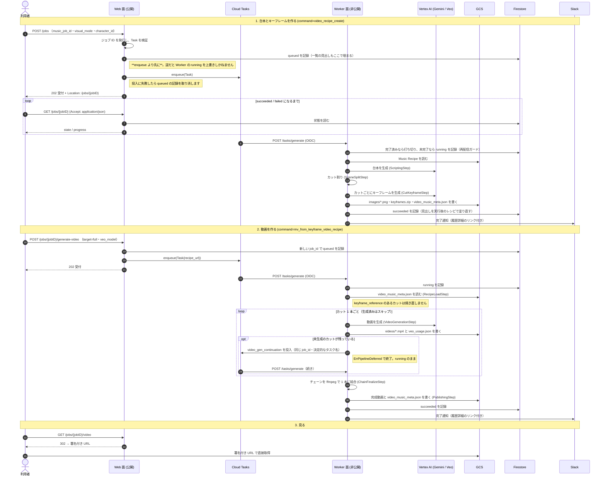

# 🎬 AP MV

[](https://github.com/shouni/ap-mv/actions/workflows/ci.yml)
[](#)
[](https://go.dev/)
[](https://cloud.google.com/run)
[](https://opensource.org/licenses/MIT)

## 🚀 概要 (About) - 楽曲の拍と盛り上がりに合わせて、カットを繋ぐ

**AP MV** は、楽曲生成サービスが書き出した Music Recipe（楽曲構成書 JSON）からミュージックビデオを
作る Cloud Run + Cloud Tasks 上のサービスです。Gemini にカット割りの台本（VideoRecipe: カットごとの
`visual_anchor` / `audio_cue` / 歌詞）を書かせ、カットごとにキーフレーム画像を生成し、
Veo (Vertex AI) でカットの動画を作り、ffmpeg で 1 本に結合します。成果物はジョブごとの
`video_music_meta.json` と画像・動画で、`gs://<AP_MV_BUCKET>/<VEO_OUTPUT_PREFIX>/jobs/<jobID>/` に置きます。

**台本・キーフレーム・動画は別々に進められます。** 台本だけで止めて（`video_recipe_draft`）カット割りを
確認し、`PUT /jobs/{jobID}/recipe` で直してから画像を焼き、動画は全カット・セクション単位・
カット単位のどれでも作り直せます。動画はカット 1 本ずつ生成し、続きは worker が自分で
Cloud Tasks へ再投入するため、長尺でも 1 タスクの時間上限に収まります。生成済みのカットは
スキップされるので、同じレシピを投げ直せば途中から再開できます。

1 つのイメージを `SERVER_ROLE` で **Web 面（公開）と Worker 面（非公開）の 2 サービス**として
デプロイします。画面が指す画像・動画は同一オリジンのパスで、ハンドラーが GCS の署名付き URL へ
302 します。`Accept: application/json` の応答だけが署名付き URL そのものを返します。

---

## 📦 使い方

### 1. 環境設定

`ValidateEssentialConfig` はロールごとに必要なものだけを検証します。

**どのロールでも必須**

| 変数名 | 説明 |
| --- | --- |
| `SERVER_ROLE` | `web` / `worker` / `both`（`both` はローカル開発用）。**未設定・未知の値は起動時エラー**です。担当する面だけを組み立て、ルートもその面のものだけを登録します。 |
| `GCP_PROJECT_ID` / `GCP_LOCATION_ID` | GCP プロジェクトと、Cloud Tasks / Vertex AI のリージョン。Gemini と Veo は Vertex AI 経由でのみ呼びます（API キー経路はありません）。 |
| `CLOUD_TASKS_QUEUE_ID` | 投入先のキュー名。**worker も継続タスクを投入するため、どちらのロールでも必須**です。 |
| `WORKER_URL` | worker **サービス**の URL。パスは含めません。worker を担うロールでは未設定なら `SERVICE_URL` を使いますが、`web` では明示が必要です。本番では HTTPS が必須です。 |
| `TASK_CALLER_SERVICE_ACCOUNT_EMAIL` | タスクに載せる caller SA。トークンを発行するのは Cloud Tasks で、このプロセスが署名するわけではありません。 |
| `AP_MV_BUCKET` | 成果物の置き場。`my-bucket` / `gs://my-bucket` のどちらでも指定できます。 |
| `GEMINI_MODELS` / `IMAGE_MODELS` / `VEO_MODELS` | 台本・キーフレーム・動画のモデル名。**カンマ区切りで複数指定でき、先頭が既定モデル**、全体がフォームの選択肢になります。**既定値は持たず、どれか 1 つでも空なら起動時にエラー**になります。 |
| `VEO_OUTPUT_PREFIX` | 成果物のプレフィックス（`gs://<AP_MV_BUCKET>/<VEO_OUTPUT_PREFIX>/jobs/` の下にジョブが並びます）。**既定値は持たず、空なら起動時にエラー**です。 |

**Web 面（`web` / `both`）で必須**

| 変数名 | 説明 |
| --- | --- |
| `GOOGLE_CLIENT_ID` / `GOOGLE_CLIENT_SECRET` | Google OAuth のクライアント。 |
| `ALLOWED_EMAILS` / `ALLOWED_DOMAINS` | ログインを許可する相手（カンマ区切り）。**どちらも空だと起動しません。** |
| `ALLOWED_M2M_SERVICE_ACCOUNTS` | 機械（MCP ゲートウェイなど）が OIDC Bearer で叩くときに許可する SA（カンマ区切り）。audience は `SERVICE_URL` です。**空だと起動しません。** |
| `SESSION_FIRESTORE_DATABASE` / `SESSION_FIRESTORE_COLLECTION` | セッションを置く Firestore（既定はどちらも `sessions`）。**ジョブ状態用とは別のデータベースを指します。** |

**Worker 面（`worker` / `both`）で必須**

| 変数名 | 説明 |
| --- | --- |
| `TASK_AUDIENCE_URL` | Cloud Tasks の OIDC 検証の audience（worker 自身の URL）。未設定なら `SERVICE_URL` を使うため、web/worker を分けた場合は明示します。 |
| `ALLOWED_TASK_SERVICE_ACCOUNTS` | 受け付ける caller SA（カンマ区切り）。web と worker の両方の SA を並べます（worker も継続タスクを投入するため）。 |
| `TASK_DISPATCH_DEADLINE` | Cloud Tasks がワーカーの応答を待つ上限（例: `30m`）。既定値は持ちません。 |
| `PIPELINE_TIMEOUT` | タスク 1 件の実行上限（例: `25m`）。継続タスクにはそれぞれ個別に掛かります。**`PIPELINE_TIMEOUT < TASK_DISPATCH_DEADLINE <= Cloud Run の timeout` を守り、等号と無制限（0 以下）は起動時に拒否されます。** |

**任意**

| 変数名 | 説明 |
| --- | --- |
| `SERVICE_URL` / `PORT` | 公開 URL と待ち受けポート (Default: `http://localhost:8080` / `8080`)。本番の `SERVICE_URL` は HTTPS 必須で、OAuth のコールバック・M2M 検証の audience・Slack 通知のリンク元を兼ねるため、**worker にも web の URL** を設定します。 |
| `LOG_LEVEL` | ログレベル `DEBUG` / `INFO` / `WARN` / `ERROR` (Default: `INFO`)。`main.go` が読みます。 |
| `FIRESTORE_DATABASE` | ジョブ状態を置く Firestore データベース (Default: `job-status`)。コレクション名 `ap-mv` は設定にしません。 |
| `AP_MUSIC_BUCKET` | 作成フォームの Music Job ID から `gs://<bucket>/music/<jobID>/recipe.json` を組み立てるためのバケット。**楽曲生成サービス・ナレーション生成サービスと同じ変数名・同じ規則です。** |
| `VEO_LOCATION_ID` | Veo を呼ぶ Vertex AI のロケーション (Default: `GCP_LOCATION_ID` の値)。`global` も指定できます。 |
| `VEO_ASPECT_RATIO` | `16:9` または `9:16` (Default: `16:9`)。タスクの `veo_aspect_ratio` があればそちらを使います。 |
| `VEO_GENERATE_AUDIO` | Veo の `generateAudio` (Default: `false`)。 |
| `VEO_POLL_INTERVAL` / `VEO_OPERATION_TIMEOUT` / `VEO_POLL_MAX_ERRORS` | 生成オペレーションのポーリング間隔・1 カットの待機上限・連続失敗の許容回数 (Default: `10s` / `20m` / `10`)。 |
| `VEO_USE_PREVIOUS_VIDEO` | `true` で前カットの動画を入力にする video_extension（video-to-video）方式にします (Default: `false`)。 |
| `VEO_PRICE_USD_PER_SEC` | 履歴画面に出す概算コストの単価表（`モデル名:USD/生成 1 秒` をカンマ区切り。空キー `:0.40` は表に無いモデルの既定）。未設定なら全モデル `0.40`。請求額と一致することは保証しません。 |
| `KEYFRAME_MAX_CONCURRENCY` / `KEYFRAME_RATE_INTERVAL` | AI 呼び出しの同時実行数と発射間隔の下限 (Default: `1` / `60s`)。間隔は台本のテキスト生成にも掛かり、スループットは並列度によらず `1/KEYFRAME_RATE_INTERVAL` で頭打ちです（両方を上げると起動時に警告）。 |
| `KEYFRAME_IMAGE_SIZE` | キーフレームの解像度 `1K` / `2K` / `4K` (Default: `2K`)。**それ以外は起動時に落ちます。** |
| `SLACK_WEBHOOK_URL` | 完了・失敗の通知先。未設定なら通知は無効になります。 |

> 環境変数が持つのは**デプロイ先が決める設定**だけです。入力元・モデル・対象カットといった
> 実行ごとに変わる値は、タスクのペイロード（JSON）で渡します。実行 SA の権限は
> `ap-infra` の Terraform が持ちます。

### 2. 起動

```bash
go run .        # SERVER_ROLE が必須
```

`SERVER_ROLE` が担う面だけを組み立てます。

| ロール | 組み立てるもの | 公開されるルート |
| --- | --- | --- |
| `web` | 投入フォーム・履歴画面・Cloud Tasks への投入・Firestore/GCS の読み書き | `/`, `/compose`, `/jobs/*`, `/auth/*` |
| `worker` | パイプライン（Gemini + Veo + ffmpeg + GCS + 通知）と Cloud Tasks への投入（継続タスク） | `POST /tasks/generate` |
| `both` | 両方（ローカル開発用） | 上記すべて |

`both` で `go run .` すると画面は確認できますが、**Cloud Tasks は localhost へ配送できないため
パイプラインは走りません。** ロジックの確認は `go test ./... -race` で行います。

### 3. HTTP エンドポイント

**認証は 1 つです。** `auth.Protected` が OIDC の Bearer（audience は `SERVICE_URL`、
`ALLOWED_M2M_SERVICE_ACCOUNTS` の SA）とセッションの両方を通すため、同じ URL を人も機械も
叩けます。`GET /health` と `/static/*` だけが認証の外側で、ロールに関係なく登録されます。

| メソッド | パス | 用途 |
| --- | --- | --- |
| `GET` | `/health` | ヘルスチェック（`/healthz` は Cloud Run の既定ドメイン側で予約パス扱いになるため使いません）。認証不要 |
| `GET` | `/static/*` | 埋め込みの CSS / JS と `vendor/` 配下の Bootstrap。認証不要。`vendor/` は `public, max-age=31536000, immutable`、自前アセットは `public, max-age=300, must-revalidate` |
| `GET` | `/auth/login` `/auth/callback` `/auth/logout` | Google OAuth のログイン・コールバック・ログアウト |
| `GET` | `/` | ホーム（直近 10 件と、最新の完成動画） |
| `GET` | `/compose` | 作成フォーム。押したボタンで `command` が決まります（「Queue Draft Job」= `video_recipe_draft`、「Queue Video Recipe Job」= `video_recipe_create`） |
| `POST` | `/jobs` | ジョブを投入。フォーム本文の `command` で分かれます: `video_recipe_create`（既定。台本 → キーフレームまで）/ `video_recipe_draft`（台本まで）/ `mv_from_keyframe_video_recipe`（`recipe_json` または `recipe_url` の VideoRecipe から動画まで。機械向け）。受付は `202` と `Location: /jobs/{jobID}` |
| `GET` | `/jobs` | ジョブを新しい順に 20 件ずつ。`?page=` / `?stage=`（`script` / `keyframes` / `keyframes_done` / `videos` / `completed`。未知の値は絞り込みなし）。一覧に出るのは `video_recipe_create` / `video_recipe_draft` / `mv_from_keyframe_video_recipe` / `short_video_from_section` / `regenerate_cut_video` のジョブで、元ジョブへ書き戻す保守コマンドは出ません。成果物の無いジョブは行から削除できます |
| `GET` | `/jobs/{jobID}` | ジョブ 1 件。投入から削除まで同じ URL です。未完了・失敗のジョブは進行状況（画面は自動更新、JSON は `queued` / `running` / `succeeded` / `failed` と失敗理由・試行回数）。完成したジョブは詳細画面（カットごとのキーフレーム・動画・`visual_anchor`・`dialogue`、概算コスト、作り直しの導線）で、JSON は状態に `detail`（署名付き URL 入り）を入れ子にした 1 つの文書です |
| `DELETE` | `/jobs/{jobID}` | ジョブの成果物と状態の記録をまとめて削除。画面の削除ボタンも fetch で DELETE を送ります |
| `GET` | `/jobs/{jobID}/recipe` | 保存済みの VideoRecipe を `{"job_id", "recipe"}` で返す。表示用に整形した詳細とは別経路で、そのまま直して PUT へ返せます |
| `PUT` | `/jobs/{jobID}/recipe` | レシピを上書き保存（本文は `{"recipe": {...}}` か VideoRecipe 単体、5MB まで）。**台本のみの段階（`script`）でのみ許可**で、キーフレームを焼いた後は 409 です。直して効くのは `visual_anchor` / `audio_cue` / `character_id` / `dialogue` で、尺は生成時に楽曲タイムラインから割り付け直されます |
| `GET` | `/jobs/{jobID}/metadata` | `video_music_meta.json` の署名付き URL へ 302 |
| `GET` | `/jobs/{jobID}/video` | 結合済み完成動画の署名付き URL へ 302 |
| `GET` | `/jobs/{jobID}/cuts/{cutIndex}/video` | カット単体の動画の署名付き URL へ 302 |
| `GET` | `/jobs/{jobID}/cuts/{cutIndex}/keyframe` | カットのキーフレーム画像の署名付き URL へ 302 |
| `GET` | `/jobs/{jobID}/keyframes` | キーフレームを `keyframes-{jobID}.zip` で一括ダウンロード（`cut_01.png` 形式の画像、ffmpeg concat demuxer 用 `inputs.txt`、歌詞があれば ASS カラオケ字幕 `subtitles.ass`） |
| `GET` | `/jobs/{jobID}/cuts/{cutIndex}/regenerate` | カットのキーフレーム再生成フォーム |
| `POST` | `/jobs/{jobID}/cuts/{cutIndex}/regenerate-keyframe` | カットのキーフレームを作り直す。`edit_prompt` を送ると既存画像を保った編集モード、空ならフル再生成（`visual_anchor` でプロンプト差し替え可）。`overwrite=on` でレシピを更新、`seed` はこの 1 回だけのキャラクターシード上書き。結果は元ジョブへ書き戻します |
| `POST` | `/jobs/{jobID}/cuts/{cutIndex}/regenerate-video` | カットの動画だけを作り直す（キーフレームは再利用。`veo_model` 指定可）。結果は**新しいジョブ**になり、元ジョブは変わりません |
| `GET` | `/jobs/{jobID}/sections/{sectionIndex}/regenerate` | セクション単位のキーフレーム再生成フォーム（`sectionIndex` は 0 始まり） |
| `POST` | `/jobs/{jobID}/sections/{sectionIndex}/regenerate-keyframes` | セクションの全カットのキーフレームをまとめて作り直す。`edit_prompt` / `overwrite` / `seed` はカット単位と同じ（`visual_anchor` は不可） |
| `POST` | `/jobs/{jobID}/sections/{sectionIndex}/generate-video` | セクション 1 つ分を「足りないキーフレーム → 動画」まで進め、結果を元ジョブへ書き戻す（`veo_model` 指定可）。結合はしません |
| `POST` | `/jobs/{jobID}/finalize` | セクションごとに作った動画を 1 本へ結合する。生成はしないので追加の課金はありません |
| `POST` | `/jobs/{jobID}/regenerate-zip` | `keyframes.zip` を作り直して元ジョブへ上書き。`primary_color` / `secondary_color` で字幕の色を指定できます |
| `POST` | `/jobs/{jobID}/generate-video` | 保存済みレシピから動画生成。`target=full` でフル MV（`mv_from_keyframe_video_recipe`）、`target=<セクションインデックス>` で 60 秒以内のショート動画（`short_video_from_section`）。`veo_model` 指定可。アスペクト比はキーフレーム作成時の値を引き継ぎます。結果は新しいジョブです |
| `POST` | `/tasks/generate` | Cloud Tasks 専用のワーカー。OIDC 検証を通らないリクエストは 401、`SERVER_ROLE=web` では**ルートごと登録されない**ため 404 |

**同じリソースはルートも 1 本です。** 表現は `Accept` で決まり、`application/json` を送れば JSON が、
ブラウザの `Accept` なら画面が返ります。パスの切り方は public-docs の URL 命名規約に従います。

**副作用のあるメソッドには CSRF トークンが要ります。** フォームは `csrf_token` の hidden で、
画面の JS は `X-CSRF-Token` ヘッダーで送ります。OIDC Bearer で認証した機械はこの検証に入りません。

### 4. タスクのペイロード

`POST /jobs` と各アクションはフォーム本文を受け取り、次の `command` を持つタスク（`domain.Task`）を
Cloud Tasks に載せます。工程列は `internal/pipeline/planner.go` の `DefaultPlanner.Plan` が決め、
各工程は `internal/pipeline/step/` にあります（ファイル名は実行順を表しません）。

| `command` | 何をするか | 必須フィールド | 工程列（`step/` の型名） |
| --- | --- | --- | --- |
| `video_recipe_draft` | 台本とカット割りまで作って保存。**キーフレームは焼きません** | `source_url` / `text` / `image_url` のいずれか | `ScriptingStep` → `SceneSplitStep` → `RecipeSaveStep` |
| `video_recipe_create` | 台本 → 全カットのキーフレーム → zip | 同上 | `ScriptingStep` → `SceneSplitStep` → `CutKeyframeStep` → `ZipUploadStep` |
| `mv_from_keyframe_video_recipe` | 保存済みレシピから動画まで。キーフレームがあるカットは焼き直しません | `recipe` / `video_recipe` / `recipe_url` のいずれか | `RecipeLoadStep` → `SceneSplitStep` → `CutKeyframeStep` → `ZipUploadStep` → `VideoGenerationStep` → `ChainFinalizeStep` → `PublishingStep` |
| `short_video_from_section` | 1 セクションだけを 60 秒以内のショートとして新しいジョブに作る | 同上 + `section_index` | `RecipeLoadStep` → `SectionSelectStep` → `VideoGenerationStep` → `ChainFinalizeStep` → `PublishingStep` |
| `section_video` | 1 セクションの足りないキーフレームと動画を作り、レシピ全体を元ジョブへ書き戻す。結合しません | 同上 + `section_index` | `RecipeLoadStep` → `OriginalJobOutputStep` → `SectionKeyframeStep` → `ZipUploadStep` → `VideoGenerationStep`（セクション限定） → `PublishingStep` |
| `finalize_video` | 生成済みカットの動画を 1 本へ結合し直す。生成はしません | `recipe` / `video_recipe` / `recipe_url` のいずれか | `RecipeLoadStep` → `OriginalJobOutputStep` → `ChainFinalizeStep` → `PublishingStep` |
| `regenerate_cut_video` | 1 カット（video_extension 方式ではそのチェーンの残りも）の動画を作り直し、新しいジョブに結合し直す | 同上 + `cut_index` | `RecipeLoadStep` → `CutVideoSelectStep` → `VideoGenerationStep` → `ChainFinalizeStep` → `PublishingStep` |
| `regenerate_cut_keyframe` / `regenerate_section_keyframes` | カット 1 枚 / セクションの全カットのキーフレームを作り直し、元ジョブへ書き戻す | 同上 + `cut_index` / `section_index` | `RecipeLoadStep` → `RegenerateCutKeyframeStep` → `ZipUploadStep` |
| `regenerate_zip` | `keyframes.zip` を作り直す | `recipe_url` | `RecipeLoadStep` → `ZipUploadStep` |
| `video_gen_continuation` | `VideoGenerationStep` が内部で投入する続き。`origin_command` の計画を引き継ぎます | （worker が組み立てます） | `VideoGenerationStep` → `ChainFinalizeStep` → `PublishingStep`（`section_video` の続きは `OriginalJobOutputStep` → `VideoGenerationStep` → `PublishingStep`） |

| フィールド | 説明 |
| --- | --- |
| `job_id` | ジョブの識別子。成果物の置き場もこれで決まります。作り直し系は新しい ID を採番し、元ジョブへ書き戻すものは `original_job_id` に元の ID を持ちます。 |
| `command` | 上の表のいずれか。**省略できません。** |
| `source_url` / `text` / `image_url` | 台本の入力。フォームは `music_job_id` から `gs://<AP_MUSIC_BUCKET>/music/<jobID>/recipe.json` を組み立てて `source_url` に入れます（機械は `url` で直接渡せます）。`source_url` は `gs://` のみ。 |
| `recipe` / `video_recipe` / `recipe_url` | 保存済みレシピの入力。`recipe_url` は `gs://.../video_music_meta.json`（Music Recipe の JSON も互換入力として読み、VideoRecipe に変換します）。フォームでは `recipe_json` / `recipe_url`。 |
| `audio_url` | 音源の `gs://` URI。全カットの空の `audio_reference` に補完されます。カットごとに変えたいときは `video_recipe.cuts[].audio_reference` を使います（こちらが優先）。 |
| `visual_mode` / `character_id` | 映像スタイル（`assets/prompts/visual_modes/*.md`）とキャラクター。 |
| `text_model` / `image_model` / `veo_model` / `veo_aspect_ratio` | モデルとアスペクト比（`16:9` / `9:16`）の上書き。空なら各 `*_MODELS` の先頭と `VEO_ASPECT_RATIO`。 |
| `cut_index` / `section_index` | 対象のカット番号（1 始まり）/ セクションの配列インデックス（0 始まり）。 |
| `edit_prompt` / `visual_anchor_override` / `seed_override` / `seed_override_character_id` / `overwrite_keyframe` | キーフレーム再生成の指示（編集モード / プロンプト差し替え / シードの一時上書き / レシピを更新するか）。 |
| `ass_primary_color` / `ass_secondary_color` | カラオケ字幕の歌唱済み / 未歌唱の色（CSS hex）。 |

```json
{
  "command": "video_recipe_create",
  "job_id": "video-recipe-20260904-101500-1a2b3c4d5e6f",
  "source_url": "gs://ap-music/music/20260711132823-256e9128/recipe.json",
  "visual_mode": "default",
  "character_id": "zunda",
  "veo_aspect_ratio": "16:9"
}
```

```json
{
  "command": "mv_from_keyframe_video_recipe",
  "job_id": "mv-20260904-113000-9f8e7d6c5b4a",
  "recipe_url": "gs://ap-mv/veo/jobs/video-recipe-20260904-101500-1a2b3c4d5e6f/video_music_meta.json",
  "audio_url": "gs://ap-music/music/20260711132823-256e9128/music.mp3",
  "veo_model": "veo-3.1-generate-preview"
}
```

**継続タスクはレシピをペイロードで持ち回ります。** `video_gen_continuation` は生成済みの状態を含む
`video_recipe` と `origin_command` を載せ、同じ `job_id` で投入されます。

---

## 🔄 処理シーケンス図



## 🌳 プロジェクト構成ツリー図

```text
ap-mv/
├── main.go                  # エントリポイント（ロガー設定・サーバー起動）
├── Dockerfile               # scratch イメージ（静的バイナリのみ）
├── cloudbuild.yaml          # ビルドして 2 サービス（ap-mv / ap-mv-worker）へデプロイ
├── assets/                  # 埋め込み（prompts/{video_recipe,visual_modes,video_gen}・templates/*.html・static/）
└── internal/
    ├── config/              # 環境変数の読み込みとロール別検証
    ├── server/              # chi ルーター・グレースフルシャットダウン
    │   └── handlers/        #   Web 面（投入フォーム・一覧・詳細・成果物の 302・作り直し）
    ├── domain/              # タスクモデル・コマンド定数・ジョブ状態と進行段階・レシピ型・字幕・コスト
    ├── ports/               # アプリ内境界（VideoRunner / TaskQueue / HistoryRepository / VideoProcessor）
    ├── app/                 # DI コンテナとリソース管理
    ├── builder/             # 外部依存・ハンドラー・パイプラインの組み立て（Cloud Tasks の投入もここ）
    ├── repository/          # 履歴（一覧は Firestore、詳細と zip は GCS）・レシピの読み書き・ジョブ状態
    ├── pipeline/            # ワーカー本体。planner.go が command から工程列を決める
    │   └── step/            #   各工程（recipe_load / scripting / scene_split / cut_gen / video_gen / chain_finalize / publishing ほか）
    └── adapters/            # Vertex AI（Gemini・Veo）/ ffmpeg / Slack
        └── prompt/          #   Gemini へ送るプロンプト（台本・キーフレーム）
```

---

## 📜 ライセンス (License)

* このプロジェクトは [MIT License](https://opensource.org/licenses/MIT) の下で公開されています。
